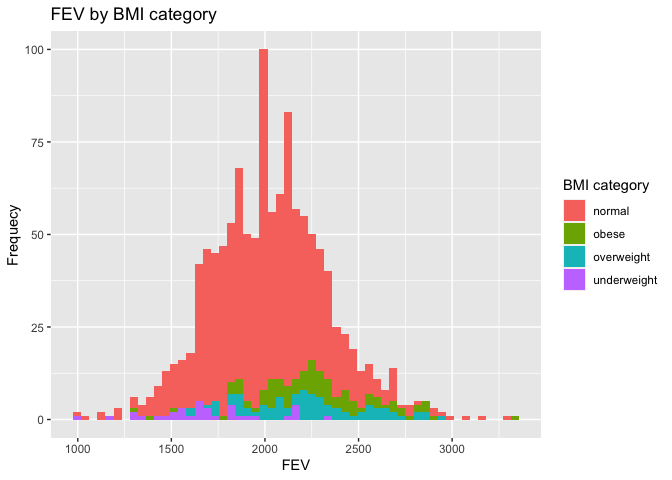
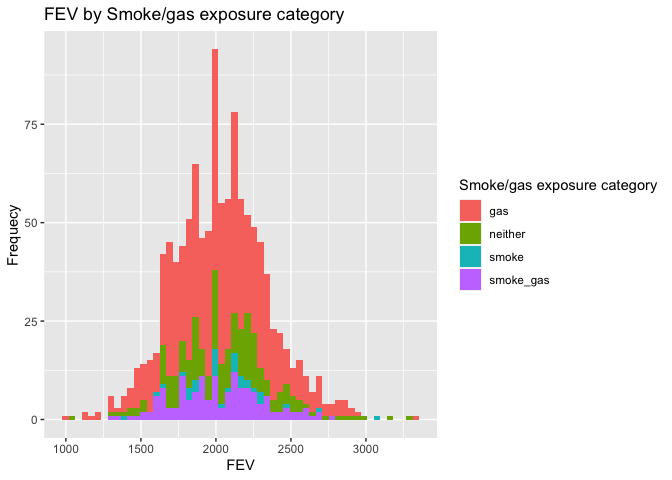
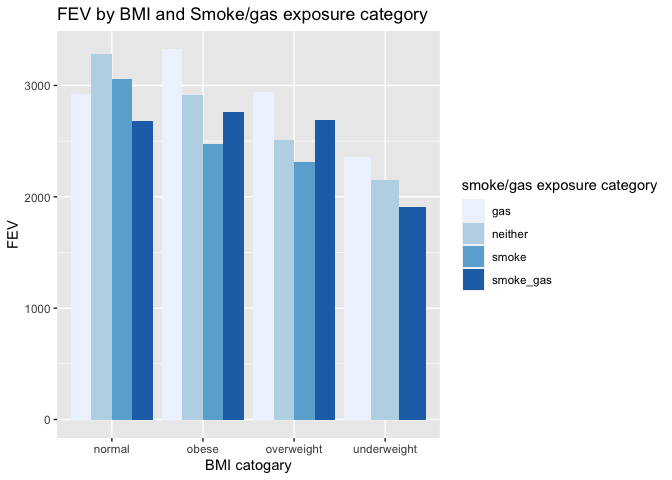
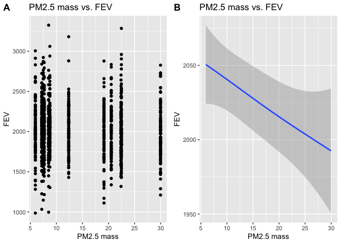

## Learning objectives

Conducting data wrangling and visualize the data with key questions in mind.

## I. Data Wrangling


```r
fn1 <- "chs_individual.csv"
if (!file.exists(fn1))
  download.file("https://raw.githubusercontent.com/USCbiostats/data-science-data/master/01_chs/chs_individual.csv", destfile = fn1)

chs_individual<-read.csv(fn1)
chs_individual<-as_tibble(chs_individual)

fn2 <- "chs_regional.csv"
if (!file.exists(fn2))
  download.file("https://raw.githubusercontent.com/USCbiostats/data-science-data/master/01_chs/chs_regional.csv", destfile = fn2)

chs_regional<-read.csv(fn2)
chs_regional<-as_tibble(chs_regional)

chs <- merge(
  x = chs_individual,
  y = chs_regional,
  by = "townname"
)
```

## Step 1

After merging the data, make sure you don’t have any duplicates by counting the number of rows. Make sure it matches.

In the case of missing values, impute data using the average within the variables “male” and “hispanic.”


```r
summary(chs)
```

```
##    townname              sid              male            race          
##  Length:1200        Min.   :   1.0   Min.   :0.0000   Length:1200       
##  Class :character   1st Qu.: 528.8   1st Qu.:0.0000   Class :character  
##  Mode  :character   Median :1041.5   Median :0.0000   Mode  :character  
##                     Mean   :1037.5   Mean   :0.4917                     
##                     3rd Qu.:1554.2   3rd Qu.:1.0000                     
##                     Max.   :2053.0   Max.   :1.0000                     
##                                                                         
##     hispanic          agepft           height        weight      
##  Min.   :0.0000   Min.   : 8.961   Min.   :114   Min.   : 42.00  
##  1st Qu.:0.0000   1st Qu.: 9.610   1st Qu.:135   1st Qu.: 65.00  
##  Median :0.0000   Median : 9.906   Median :139   Median : 74.00  
##  Mean   :0.4342   Mean   : 9.924   Mean   :139   Mean   : 79.33  
##  3rd Qu.:1.0000   3rd Qu.:10.177   3rd Qu.:143   3rd Qu.: 89.00  
##  Max.   :1.0000   Max.   :12.731   Max.   :165   Max.   :207.00  
##                   NA's   :89       NA's   :89    NA's   :89      
##       bmi            asthma       active_asthma  father_asthma    
##  Min.   :11.30   Min.   :0.0000   Min.   :0.00   Min.   :0.00000  
##  1st Qu.:15.78   1st Qu.:0.0000   1st Qu.:0.00   1st Qu.:0.00000  
##  Median :17.48   Median :0.0000   Median :0.00   Median :0.00000  
##  Mean   :18.50   Mean   :0.1463   Mean   :0.19   Mean   :0.08318  
##  3rd Qu.:20.35   3rd Qu.:0.0000   3rd Qu.:0.00   3rd Qu.:0.00000  
##  Max.   :41.27   Max.   :1.0000   Max.   :1.00   Max.   :1.00000  
##  NA's   :89      NA's   :31                      NA's   :106      
##  mother_asthma        wheeze          hayfever         allergy      
##  Min.   :0.0000   Min.   :0.0000   Min.   :0.0000   Min.   :0.0000  
##  1st Qu.:0.0000   1st Qu.:0.0000   1st Qu.:0.0000   1st Qu.:0.0000  
##  Median :0.0000   Median :0.0000   Median :0.0000   Median :0.0000  
##  Mean   :0.1023   Mean   :0.3313   Mean   :0.1747   Mean   :0.2929  
##  3rd Qu.:0.0000   3rd Qu.:1.0000   3rd Qu.:0.0000   3rd Qu.:1.0000  
##  Max.   :1.0000   Max.   :1.0000   Max.   :1.0000   Max.   :1.0000  
##  NA's   :56       NA's   :71       NA's   :118      NA's   :63      
##   educ_parent        smoke             pets           gasstove     
##  Min.   :1.000   Min.   :0.0000   Min.   :0.0000   Min.   :0.0000  
##  1st Qu.:2.000   1st Qu.:0.0000   1st Qu.:1.0000   1st Qu.:1.0000  
##  Median :3.000   Median :0.0000   Median :1.0000   Median :1.0000  
##  Mean   :2.797   Mean   :0.1638   Mean   :0.7667   Mean   :0.7815  
##  3rd Qu.:3.000   3rd Qu.:0.0000   3rd Qu.:1.0000   3rd Qu.:1.0000  
##  Max.   :5.000   Max.   :1.0000   Max.   :1.0000   Max.   :1.0000  
##  NA's   :64      NA's   :40                        NA's   :33      
##       fev              fvc            mmef          pm25_mass     
##  Min.   : 984.8   Min.   : 895   Min.   : 757.6   Min.   : 5.960  
##  1st Qu.:1809.0   1st Qu.:2041   1st Qu.:1994.0   1st Qu.: 7.615  
##  Median :2022.7   Median :2293   Median :2401.5   Median :10.545  
##  Mean   :2031.3   Mean   :2324   Mean   :2398.8   Mean   :14.362  
##  3rd Qu.:2249.7   3rd Qu.:2573   3rd Qu.:2793.8   3rd Qu.:20.988  
##  Max.   :3323.7   Max.   :3698   Max.   :4935.9   Max.   :29.970  
##  NA's   :95       NA's   :97     NA's   :106                      
##     pm25_so4        pm25_no3         pm25_nh4         pm25_oc      
##  Min.   :0.790   Min.   : 0.730   Min.   :0.4100   Min.   : 1.450  
##  1st Qu.:1.077   1st Qu.: 1.538   1st Qu.:0.7375   1st Qu.: 2.520  
##  Median :1.815   Median : 2.525   Median :1.1350   Median : 4.035  
##  Mean   :1.876   Mean   : 4.488   Mean   :1.7642   Mean   : 4.551  
##  3rd Qu.:2.605   3rd Qu.: 7.338   3rd Qu.:2.7725   3rd Qu.: 5.350  
##  Max.   :3.230   Max.   :12.200   Max.   :4.2500   Max.   :11.830  
##                                                                    
##     pm25_ec          pm25_om          pm10_oc          pm10_ec      
##  Min.   :0.1300   Min.   : 1.740   Min.   : 1.860   Min.   :0.1400  
##  1st Qu.:0.4000   1st Qu.: 3.020   1st Qu.: 3.228   1st Qu.:0.4100  
##  Median :0.5850   Median : 4.840   Median : 5.170   Median :0.5950  
##  Mean   :0.7358   Mean   : 5.460   Mean   : 5.832   Mean   :0.7525  
##  3rd Qu.:1.1750   3rd Qu.: 6.418   3rd Qu.: 6.855   3rd Qu.:1.1975  
##  Max.   :1.3600   Max.   :14.200   Max.   :15.160   Max.   :1.3900  
##                                                                     
##     pm10_tc           formic          acetic           hcl        
##  Min.   : 1.990   Min.   :0.340   Min.   :0.750   Min.   :0.2200  
##  1st Qu.: 3.705   1st Qu.:0.720   1st Qu.:2.297   1st Qu.:0.3250  
##  Median : 6.505   Median :1.105   Median :2.910   Median :0.4350  
##  Mean   : 6.784   Mean   :1.332   Mean   :3.010   Mean   :0.4208  
##  3rd Qu.: 8.430   3rd Qu.:1.765   3rd Qu.:4.000   3rd Qu.:0.4625  
##  Max.   :16.440   Max.   :2.770   Max.   :5.140   Max.   :0.7300  
##                                                                   
##       hno3           o3_max          o3106           o3_24      
##  Min.   :0.430   Min.   :38.27   Min.   :28.22   Min.   :18.22  
##  1st Qu.:1.593   1st Qu.:49.93   1st Qu.:41.90   1st Qu.:23.31  
##  Median :2.455   Median :64.05   Median :46.74   Median :27.59  
##  Mean   :2.367   Mean   :60.16   Mean   :47.76   Mean   :30.23  
##  3rd Qu.:3.355   3rd Qu.:67.69   3rd Qu.:55.24   3rd Qu.:32.39  
##  Max.   :4.070   Max.   :84.44   Max.   :67.01   Max.   :57.76  
##                                                                 
##       no2             pm10          no_24hr         pm2_5_fr    
##  Min.   : 4.60   Min.   :18.40   Min.   : 2.05   Min.   : 9.01  
##  1st Qu.:12.12   1st Qu.:20.71   1st Qu.: 4.74   1st Qu.:10.28  
##  Median :16.40   Median :29.64   Median :12.68   Median :22.23  
##  Mean   :18.99   Mean   :32.64   Mean   :16.21   Mean   :19.79  
##  3rd Qu.:23.24   3rd Qu.:39.16   3rd Qu.:26.90   3rd Qu.:27.73  
##  Max.   :37.97   Max.   :70.39   Max.   :42.95   Max.   :31.55  
##                                  NA's   :100     NA's   :300    
##      iacid           oacid        total_acids          lon        
##  Min.   :0.760   Min.   :1.090   Min.   : 1.520   Min.   :-120.7  
##  1st Qu.:1.835   1st Qu.:2.978   1st Qu.: 4.930   1st Qu.:-118.8  
##  Median :2.825   Median :4.135   Median : 6.370   Median :-117.7  
##  Mean   :2.788   Mean   :4.342   Mean   : 6.708   Mean   :-118.3  
##  3rd Qu.:3.817   3rd Qu.:5.982   3rd Qu.: 9.395   3rd Qu.:-117.4  
##  Max.   :4.620   Max.   :7.400   Max.   :11.430   Max.   :-116.8  
##                                                                   
##       lat       
##  Min.   :32.84  
##  1st Qu.:33.93  
##  Median :34.10  
##  Mean   :34.20  
##  3rd Qu.:34.65  
##  Max.   :35.49  
## 
```

```r
#var <- c("agepft", "height", "weight", "bmi", "fev", "fvc", "mmef")
#for (i in 1:length(var)){
chs <- chs %>% 
  group_by(male,race) %>% 
  mutate( agepft = ifelse(is.na(agepft), 
                         mean(agepft, na.rm = TRUE), 
                         agepft)) %>%
  mutate( height = ifelse(is.na(height), 
                         mean(height, na.rm = TRUE), 
                         height)) %>%
  mutate( weight = ifelse(is.na(weight), 
                         mean(weight, na.rm = TRUE), 
                         weight)) %>%
  mutate( bmi = ifelse(is.na(bmi), 
                         mean(bmi, na.rm = TRUE), 
                         bmi)) %>%
  mutate( fev = ifelse(is.na(fev), 
                         mean(fev, na.rm = TRUE), 
                         fev)) %>%
  mutate( fvc = ifelse(is.na(fvc), 
                         mean(fvc, na.rm = TRUE), 
                         fvc)) %>%
  mutate( mmef = ifelse(is.na(mmef), 
                         mean(mmef, na.rm = TRUE), 
                         mmef)) %>%
  mutate( no_24hr = ifelse(is.na(no_24hr), 
                         mean(no_24hr, na.rm = TRUE), 
                         no_24hr)) %>%
  mutate( pm2_5_fr = ifelse(is.na(pm2_5_fr), 
                         mean(pm2_5_fr, na.rm = TRUE), 
                         pm2_5_fr))
#}
summary(chs)
```

```
##    townname              sid              male            race          
##  Length:1200        Min.   :   1.0   Min.   :0.0000   Length:1200       
##  Class :character   1st Qu.: 528.8   1st Qu.:0.0000   Class :character  
##  Mode  :character   Median :1041.5   Median :0.0000   Mode  :character  
##                     Mean   :1037.5   Mean   :0.4917                     
##                     3rd Qu.:1554.2   3rd Qu.:1.0000                     
##                     Max.   :2053.0   Max.   :1.0000                     
##                                                                         
##     hispanic          agepft           height        weight      
##  Min.   :0.0000   Min.   : 8.961   Min.   :114   Min.   : 42.00  
##  1st Qu.:0.0000   1st Qu.: 9.632   1st Qu.:135   1st Qu.: 66.00  
##  Median :0.0000   Median : 9.903   Median :139   Median : 76.00  
##  Mean   :0.4342   Mean   : 9.923   Mean   :139   Mean   : 79.35  
##  3rd Qu.:1.0000   3rd Qu.:10.155   3rd Qu.:143   3rd Qu.: 87.00  
##  Max.   :1.0000   Max.   :12.731   Max.   :165   Max.   :207.00  
##                                                                  
##       bmi            asthma       active_asthma  father_asthma    
##  Min.   :11.30   Min.   :0.0000   Min.   :0.00   Min.   :0.00000  
##  1st Qu.:15.96   1st Qu.:0.0000   1st Qu.:0.00   1st Qu.:0.00000  
##  Median :17.77   Median :0.0000   Median :0.00   Median :0.00000  
##  Mean   :18.51   Mean   :0.1463   Mean   :0.19   Mean   :0.08318  
##  3rd Qu.:19.99   3rd Qu.:0.0000   3rd Qu.:0.00   3rd Qu.:0.00000  
##  Max.   :41.27   Max.   :1.0000   Max.   :1.00   Max.   :1.00000  
##                  NA's   :31                      NA's   :106      
##  mother_asthma        wheeze          hayfever         allergy      
##  Min.   :0.0000   Min.   :0.0000   Min.   :0.0000   Min.   :0.0000  
##  1st Qu.:0.0000   1st Qu.:0.0000   1st Qu.:0.0000   1st Qu.:0.0000  
##  Median :0.0000   Median :0.0000   Median :0.0000   Median :0.0000  
##  Mean   :0.1023   Mean   :0.3313   Mean   :0.1747   Mean   :0.2929  
##  3rd Qu.:0.0000   3rd Qu.:1.0000   3rd Qu.:0.0000   3rd Qu.:1.0000  
##  Max.   :1.0000   Max.   :1.0000   Max.   :1.0000   Max.   :1.0000  
##  NA's   :56       NA's   :71       NA's   :118      NA's   :63      
##   educ_parent        smoke             pets           gasstove     
##  Min.   :1.000   Min.   :0.0000   Min.   :0.0000   Min.   :0.0000  
##  1st Qu.:2.000   1st Qu.:0.0000   1st Qu.:1.0000   1st Qu.:1.0000  
##  Median :3.000   Median :0.0000   Median :1.0000   Median :1.0000  
##  Mean   :2.797   Mean   :0.1638   Mean   :0.7667   Mean   :0.7815  
##  3rd Qu.:3.000   3rd Qu.:0.0000   3rd Qu.:1.0000   3rd Qu.:1.0000  
##  Max.   :5.000   Max.   :1.0000   Max.   :1.0000   Max.   :1.0000  
##  NA's   :64      NA's   :40                        NA's   :33      
##       fev              fvc            mmef          pm25_mass     
##  Min.   : 984.8   Min.   : 895   Min.   : 757.6   Min.   : 5.960  
##  1st Qu.:1818.0   1st Qu.:2055   1st Qu.:2041.6   1st Qu.: 7.615  
##  Median :2015.9   Median :2282   Median :2387.2   Median :10.545  
##  Mean   :2029.8   Mean   :2322   Mean   :2397.7   Mean   :14.362  
##  3rd Qu.:2223.6   3rd Qu.:2551   3rd Qu.:2737.1   3rd Qu.:20.988  
##  Max.   :3323.7   Max.   :3698   Max.   :4935.9   Max.   :29.970  
##                                                                   
##     pm25_so4        pm25_no3         pm25_nh4         pm25_oc      
##  Min.   :0.790   Min.   : 0.730   Min.   :0.4100   Min.   : 1.450  
##  1st Qu.:1.077   1st Qu.: 1.538   1st Qu.:0.7375   1st Qu.: 2.520  
##  Median :1.815   Median : 2.525   Median :1.1350   Median : 4.035  
##  Mean   :1.876   Mean   : 4.488   Mean   :1.7642   Mean   : 4.551  
##  3rd Qu.:2.605   3rd Qu.: 7.338   3rd Qu.:2.7725   3rd Qu.: 5.350  
##  Max.   :3.230   Max.   :12.200   Max.   :4.2500   Max.   :11.830  
##                                                                    
##     pm25_ec          pm25_om          pm10_oc          pm10_ec      
##  Min.   :0.1300   Min.   : 1.740   Min.   : 1.860   Min.   :0.1400  
##  1st Qu.:0.4000   1st Qu.: 3.020   1st Qu.: 3.228   1st Qu.:0.4100  
##  Median :0.5850   Median : 4.840   Median : 5.170   Median :0.5950  
##  Mean   :0.7358   Mean   : 5.460   Mean   : 5.832   Mean   :0.7525  
##  3rd Qu.:1.1750   3rd Qu.: 6.418   3rd Qu.: 6.855   3rd Qu.:1.1975  
##  Max.   :1.3600   Max.   :14.200   Max.   :15.160   Max.   :1.3900  
##                                                                     
##     pm10_tc           formic          acetic           hcl        
##  Min.   : 1.990   Min.   :0.340   Min.   :0.750   Min.   :0.2200  
##  1st Qu.: 3.705   1st Qu.:0.720   1st Qu.:2.297   1st Qu.:0.3250  
##  Median : 6.505   Median :1.105   Median :2.910   Median :0.4350  
##  Mean   : 6.784   Mean   :1.332   Mean   :3.010   Mean   :0.4208  
##  3rd Qu.: 8.430   3rd Qu.:1.765   3rd Qu.:4.000   3rd Qu.:0.4625  
##  Max.   :16.440   Max.   :2.770   Max.   :5.140   Max.   :0.7300  
##                                                                   
##       hno3           o3_max          o3106           o3_24      
##  Min.   :0.430   Min.   :38.27   Min.   :28.22   Min.   :18.22  
##  1st Qu.:1.593   1st Qu.:49.93   1st Qu.:41.90   1st Qu.:23.31  
##  Median :2.455   Median :64.05   Median :46.74   Median :27.59  
##  Mean   :2.367   Mean   :60.16   Mean   :47.76   Mean   :30.23  
##  3rd Qu.:3.355   3rd Qu.:67.69   3rd Qu.:55.24   3rd Qu.:32.39  
##  Max.   :4.070   Max.   :84.44   Max.   :67.01   Max.   :57.76  
##                                                                 
##       no2             pm10          no_24hr          pm2_5_fr    
##  Min.   : 4.60   Min.   :18.40   Min.   : 2.050   Min.   : 9.01  
##  1st Qu.:12.12   1st Qu.:20.71   1st Qu.: 6.487   1st Qu.:13.21  
##  Median :16.40   Median :29.64   Median :13.832   Median :19.88  
##  Mean   :18.99   Mean   :32.64   Mean   :16.180   Mean   :19.81  
##  3rd Qu.:23.24   3rd Qu.:39.16   3rd Qu.:24.780   3rd Qu.:25.93  
##  Max.   :37.97   Max.   :70.39   Max.   :42.950   Max.   :31.55  
##                                                                  
##      iacid           oacid        total_acids          lon        
##  Min.   :0.760   Min.   :1.090   Min.   : 1.520   Min.   :-120.7  
##  1st Qu.:1.835   1st Qu.:2.978   1st Qu.: 4.930   1st Qu.:-118.8  
##  Median :2.825   Median :4.135   Median : 6.370   Median :-117.7  
##  Mean   :2.788   Mean   :4.342   Mean   : 6.708   Mean   :-118.3  
##  3rd Qu.:3.817   3rd Qu.:5.982   3rd Qu.: 9.395   3rd Qu.:-117.4  
##  Max.   :4.620   Max.   :7.400   Max.   :11.430   Max.   :-116.8  
##                                                                   
##       lat       
##  Min.   :32.84  
##  1st Qu.:33.93  
##  Median :34.10  
##  Mean   :34.20  
##  3rd Qu.:34.65  
##  Max.   :35.49  
## 
```

The number of rows is correct in the merged data.

All missing values in numeric variables have been imputed using the average within the variables “male” and “hispanic.”

## Step 2

Create a new categorical variable named “obesity_level” using the BMI measurement (underweight BMI<14; normal BMI 14-22; overweight BMI 22-24; obese BMI>24).

To make sure the variable is rightly coded, create a summary table that contains the minimum BMI, maximum BMI, and the total number of observations per category.


```r
chs$obesity_level <- as.factor(fifelse(chs$bmi < 14, "underweight",
        fifelse(chs$bmi < 22, "normal",
                fifelse(chs$bmi <= 24, "overweight", "obese"))))

# summary table
chs %>%
  group_by(obesity_level) %>%
  summarize(min_bmi = min(bmi),
            max_bmi = max(bmi),
            Count = n()) %>%
  knitr::kable()
```


|obesity_level |  min_bmi|  max_bmi| Count|
|:-------------|--------:|--------:|-----:|
|normal        | 14.00380| 21.96387|   975|
|obese         | 24.00647| 41.26613|   103|
|overweight    | 22.02353| 23.99650|    87|
|underweight   | 11.29640| 13.98601|    35|

Due to the table, the variable "obesity_level" is rightly coded.

## Step 3

Create another categorical variable named “smoke_gas_exposure” that summarizes “Second Hand Smoke” and “Gas Stove”. The variable should have four categories in total.

Note: smoke_gas_exposure: "smoke_gas" is both “Second Hand Smoke” and “Gas Stove”, "smoke" is only “Second Hand Smoke”, "gas" is only “Gas Stove” and "neither" is neither “Second Hand Smoke” nor “Gas Stove”.


```r
#chs[, smoke_gas_exposure := fifelse(smoke == 1, fifelse(gasstove == 1, "smoke_gas", "smoke", na=NA) , fifelse(gasstove == 1, "gas", "neither", na=NA), na=NA)]

chs$smoke_gas_exposure <- as.factor(fifelse(chs$smoke == 1, fifelse(chs$gasstove == 1, "smoke_gas", "smoke", na=NA) , fifelse(chs$gasstove == 1, "gas", "neither", na=NA), na=NA))

summary(chs$smoke_gas_exposure)
```

```
##       gas   neither     smoke smoke_gas      NA's 
##       739       214        36       151        60
```

## Step 4

Create four summary tables showing the average (or proportion, if binary) and sd of “Forced expiatory volume in 1 second (ml)” and asthma indicator by town, sex, obesity level, and “smoke_gas_exposure”.


```r
chs <- data.table(chs)

# summary by town
fev_town <- chs[ , .(
  mean_fev = mean(fev, na.rm = TRUE),
  sd_fev = sd(fev, na.rm = TRUE),
  prop_asthma = sum(asthma==1, na.rm = TRUE)/sum(asthma==1 | asthma==0, na.rm = TRUE),
  sd_asthma = sd(asthma, na.rm = TRUE))
, by = "townname"]
knitr::kable(fev_town)
```


|townname      | mean_fev|   sd_fev| prop_asthma| sd_asthma|
|:-------------|--------:|--------:|-----------:|---------:|
|Alpine        | 2087.825| 291.0673|   0.1134021| 0.3187308|
|Atascadero    | 2074.546| 325.6594|   0.2551020| 0.4381598|
|Lake Elsinore | 2040.900| 303.8209|   0.1263158| 0.3339673|
|Lake Gregory  | 2087.017| 319.4974|   0.1515152| 0.3603750|
|Lancaster     | 1996.455| 319.5905|   0.1649485| 0.3730620|
|Lompoc        | 2036.510| 350.8009|   0.1134021| 0.3187308|
|Long Beach    | 1984.095| 321.1170|   0.1354167| 0.3439642|
|Mira Loma     | 1987.399| 325.1058|   0.1578947| 0.3665767|
|Riverside     | 1982.349| 281.6790|   0.1100000| 0.3144660|
|San Dimas     | 2027.369| 318.7199|   0.1717172| 0.3790537|
|Santa Maria   | 2026.772| 312.5885|   0.1340206| 0.3424442|
|Upland        | 2026.374| 342.8847|   0.1212121| 0.3280346|

Summarized by town, we find that FEV doesn't vary much in these 12 towns, among which the highest FEV is in Alpine (2087.83ml) while the lowest is in Riverside (1982.35ml). Meanwhile, the proportion of asthma in different towns are also quite similar except the highest on which is in Atascadero (25.51%).


```r
# summary by sex
fev_sex <- chs[ , .(
  mean_fev = mean(fev, na.rm = TRUE),
  sd_fev = sd(fev, na.rm = TRUE),
  prop_asthma = sum(asthma==1, na.rm = TRUE)/sum(asthma==1 | asthma==0, na.rm = TRUE),
  sd_asthma = sd(asthma, na.rm = TRUE))
, by = "male"]
knitr::kable(fev_sex)
```


| male| mean_fev|   sd_fev| prop_asthma| sd_asthma|
|----:|--------:|--------:|-----------:|---------:|
|    1| 2104.258| 307.8060|   0.1727749| 0.3783828|
|    0| 1957.785| 313.0757|   0.1208054| 0.3261747|

Summarized by sex, we notice that both FEV and the proportion of asthma are similar in males and females, and they are both higher in males than in females. The average of FEV in males is 2104.26ml and is 1957.79ml in females. The proportion of asthma in males is 17.28 and is 12.08 in females.


```r
# summary by obesity level
fev_obesity_level <- chs[ , .(
  mean_fev = mean(fev, na.rm = TRUE),
  sd_fev = sd(fev, na.rm = TRUE),
  prop_asthma = sum(asthma==1, na.rm = TRUE)/sum(asthma==1 | asthma==0, na.rm = TRUE),
  sd_asthma = sd(asthma, na.rm = TRUE))
, by = "obesity_level"]
knitr::kable(fev_obesity_level)
```


|obesity_level | mean_fev|   sd_fev| prop_asthma| sd_asthma|
|:-------------|--------:|--------:|-----------:|---------:|
|normal        | 1999.315| 296.3397|   0.1401475| 0.3473231|
|obese         | 2266.465| 325.1774|   0.2100000| 0.4093602|
|overweight    | 2224.322| 317.4261|   0.1647059| 0.3731162|
|underweight   | 1699.072| 304.4179|   0.0857143| 0.2840286|

Summarized by obesity level, we can conclude that there is a positive association between BMI and FEV. The significance of the association needs to be explored in future analysis. The results show that people who are obese have both the highest mean FEV (2266.47ml) and the highest proportion of asthma (21%), while underweight people have both the lowest mean FEV (1699.07ml) and the lowest proportion of asthma (8.57%)


```r
# summary by “smoke_gas_exposure”
fev_smoke_gas_exposure <- chs[-which(is.na(smoke_gas_exposure))][ , .(
  mean_fev = mean(fev, na.rm = TRUE),
  sd_fev = sd(fev, na.rm = TRUE),
  prop_asthma = sum(asthma==1, na.rm = TRUE)/sum(asthma==1 | asthma==0, na.rm = TRUE),
  sd_asthma = sd(asthma, na.rm = TRUE))
, by = "smoke_gas_exposure"]
knitr::kable(fev_smoke_gas_exposure)
```


|smoke_gas_exposure | mean_fev|   sd_fev| prop_asthma| sd_asthma|
|:------------------|--------:|--------:|-----------:|---------:|
|neither            | 2053.962| 331.3461|   0.1476190| 0.3555696|
|gas                | 2026.090| 318.1995|   0.1477428| 0.3550878|
|smoke              | 2062.950| 294.8501|   0.1714286| 0.3823853|
|smoke_gas          | 2019.123| 300.4153|   0.1301370| 0.3376123|

Summarized by obesity level, it shows that people who are exposed to smoke only have both the highest mean FEV (2062.95ml) and the highest proportion of asthma (17.14%), while people who are exposed to both smoke and gas have the lowest mean FEV (2019.12ml) and the lowest proportion of asthma (13.01%)

## II. Looking at the Data (EDA)

The primary questions of interest are: 1. What is the association between BMI and FEV (forced expiatory volume)? 2. What is the association between smoke and gas exposure and FEV? 3. What is the association between PM2.5 exposure and FEV?

Follow the EDA checklist from week 3 and the previous assignment. Be sure to focus on the key variables. Visualization Create the following figures and interpret them. Be sure to include easily understandable axes, titles, and legends.

First, check the dimensions, headers, footers, variable names and variable types.


```r
dim(chs)
```

```
## [1] 1200   51
```

```r
head(chs)
```

```
##    townname sid male race hispanic    agepft height weight      bmi asthma
## 1:   Alpine 841    1    W        1 10.548939    150     78 15.75758      0
## 2:   Alpine 835    0    W        0 10.099932    143     69 15.33749      0
## 3:   Alpine 838    0    O        1  9.486653    133     62 15.93183      0
## 4:   Alpine 840    0    W        0  9.965777    146     78 16.63283      0
## 5:   Alpine 865    0    W        0 10.039699    162    140 24.24797      1
## 6:   Alpine 867    0    W        1  9.957563    141     94 21.49151      0
##    active_asthma father_asthma mother_asthma wheeze hayfever allergy
## 1:             0             0             0      0        0       0
## 2:             0             0             0      0        0       1
## 3:             0             0             0      0        0       0
## 4:             0             0             0      0        0       0
## 5:             1             0             0      1        0       1
## 6:             0            NA             0      0        0       0
##    educ_parent smoke pets gasstove      fev      fvc     mmef pm25_mass
## 1:           5     0    1        0 2251.505 2594.649 2445.151      8.74
## 2:           3     0    1        0 2529.276 2826.316 3406.579      8.74
## 3:           4    NA    1        0 1737.793 1963.545 2133.110      8.74
## 4:          NA    NA    0       NA 2466.791 2638.221 3466.464      8.74
## 5:           3     0    1        1 2583.934 3567.541 2071.475      8.74
## 6:           5     0    1        1 1973.115 2154.098 2690.164      8.74
##    pm25_so4 pm25_no3 pm25_nh4 pm25_oc pm25_ec pm25_om pm10_oc pm10_ec pm10_tc
## 1:     1.73     1.59     0.88    2.54    0.48    3.04    3.25    0.49    3.75
## 2:     1.73     1.59     0.88    2.54    0.48    3.04    3.25    0.49    3.75
## 3:     1.73     1.59     0.88    2.54    0.48    3.04    3.25    0.49    3.75
## 4:     1.73     1.59     0.88    2.54    0.48    3.04    3.25    0.49    3.75
## 5:     1.73     1.59     0.88    2.54    0.48    3.04    3.25    0.49    3.75
## 6:     1.73     1.59     0.88    2.54    0.48    3.04    3.25    0.49    3.75
##    formic acetic  hcl hno3 o3_max o3106 o3_24   no2  pm10 no_24hr pm2_5_fr
## 1:   1.03   2.49 0.41 1.98  65.82 55.05 41.23 12.18 24.73    2.48    10.28
## 2:   1.03   2.49 0.41 1.98  65.82 55.05 41.23 12.18 24.73    2.48    10.28
## 3:   1.03   2.49 0.41 1.98  65.82 55.05 41.23 12.18 24.73    2.48    10.28
## 4:   1.03   2.49 0.41 1.98  65.82 55.05 41.23 12.18 24.73    2.48    10.28
## 5:   1.03   2.49 0.41 1.98  65.82 55.05 41.23 12.18 24.73    2.48    10.28
## 6:   1.03   2.49 0.41 1.98  65.82 55.05 41.23 12.18 24.73    2.48    10.28
##    iacid oacid total_acids       lon      lat obesity_level smoke_gas_exposure
## 1:  2.39  3.52         5.5 -116.7664 32.83505        normal            neither
## 2:  2.39  3.52         5.5 -116.7664 32.83505        normal            neither
## 3:  2.39  3.52         5.5 -116.7664 32.83505        normal               <NA>
## 4:  2.39  3.52         5.5 -116.7664 32.83505        normal               <NA>
## 5:  2.39  3.52         5.5 -116.7664 32.83505         obese                gas
## 6:  2.39  3.52         5.5 -116.7664 32.83505        normal                gas
```

```r
tail(chs)
```

```
##    townname  sid male race hispanic    agepft   height   weight      bmi asthma
## 1:   Upland 1866    0    O        1  9.806982 139.0000 60.00000 14.11559      0
## 2:   Upland 1867    0    M        1  9.618070 140.0000 71.00000 16.46568      0
## 3:   Upland 2033    0    M        0 10.121834 130.0000 67.00000 18.02044      0
## 4:   Upland 2031    1    W        0  9.798768 135.0000 83.00000 20.70084      0
## 5:   Upland 2032    1    W        0  9.549624 137.0000 59.00000 14.28855      0
## 6:   Upland 2053    0    W        0  9.865192 138.8161 77.04839 18.01377      0
##    active_asthma father_asthma mother_asthma wheeze hayfever allergy
## 1:             0            NA             0      0       NA      NA
## 2:             0             1             0      0        0       0
## 3:             1             0             0      1        1       0
## 4:             0             0             0      1        0       1
## 5:             0             0             1      1        1       1
## 6:             0             0             0      0        0       0
##    educ_parent smoke pets gasstove      fev      fvc     mmef pm25_mass
## 1:           3     0    1        0 1691.275 1928.859 1890.604     22.46
## 2:           3     0    1        0 1733.338 1993.040 2072.643     22.46
## 3:           3     0    1        1 1929.866 2122.148 2558.054     22.46
## 4:           3     0    1        1 2034.177 2505.535 1814.075     22.46
## 5:           3     0    1        1 2077.703 2275.338 2706.081     22.46
## 6:           3     0    1        0 1977.729 2237.492 2377.012     22.46
##    pm25_so4 pm25_no3 pm25_nh4 pm25_oc pm25_ec pm25_om pm10_oc pm10_ec pm10_tc
## 1:     2.65     7.75     2.96    6.49    1.19    7.79    8.32    1.22    9.54
## 2:     2.65     7.75     2.96    6.49    1.19    7.79    8.32    1.22    9.54
## 3:     2.65     7.75     2.96    6.49    1.19    7.79    8.32    1.22    9.54
## 4:     2.65     7.75     2.96    6.49    1.19    7.79    8.32    1.22    9.54
## 5:     2.65     7.75     2.96    6.49    1.19    7.79    8.32    1.22    9.54
## 6:     2.65     7.75     2.96    6.49    1.19    7.79    8.32    1.22    9.54
##    formic acetic  hcl hno3 o3_max o3106 o3_24   no2 pm10 no_24hr pm2_5_fr iacid
## 1:   2.67   4.73 0.46 4.03  63.83  46.5  22.2 37.97 40.8   18.48    27.73  4.49
## 2:   2.67   4.73 0.46 4.03  63.83  46.5  22.2 37.97 40.8   18.48    27.73  4.49
## 3:   2.67   4.73 0.46 4.03  63.83  46.5  22.2 37.97 40.8   18.48    27.73  4.49
## 4:   2.67   4.73 0.46 4.03  63.83  46.5  22.2 37.97 40.8   18.48    27.73  4.49
## 5:   2.67   4.73 0.46 4.03  63.83  46.5  22.2 37.97 40.8   18.48    27.73  4.49
## 6:   2.67   4.73 0.46 4.03  63.83  46.5  22.2 37.97 40.8   18.48    27.73  4.49
##    oacid total_acids       lon      lat obesity_level smoke_gas_exposure
## 1:   7.4       11.43 -117.6484 34.09751        normal            neither
## 2:   7.4       11.43 -117.6484 34.09751        normal            neither
## 3:   7.4       11.43 -117.6484 34.09751        normal                gas
## 4:   7.4       11.43 -117.6484 34.09751        normal                gas
## 5:   7.4       11.43 -117.6484 34.09751        normal                gas
## 6:   7.4       11.43 -117.6484 34.09751        normal            neither
```

```r
str(chs)
```

```
## Classes 'data.table' and 'data.frame':	1200 obs. of  51 variables:
##  $ townname          : chr  "Alpine" "Alpine" "Alpine" "Alpine" ...
##  $ sid               : int  841 835 838 840 865 867 842 839 844 847 ...
##  $ male              : int  1 0 0 0 0 0 1 0 1 1 ...
##  $ race              : chr  "W" "W" "O" "W" ...
##  $ hispanic          : int  1 0 1 0 0 1 1 1 1 0 ...
##  $ agepft            : num  10.55 10.1 9.49 9.97 10.04 ...
##  $ height            : num  150 143 133 146 162 141 139 142 143 137 ...
##  $ weight            : num  78 69 62 78 140 94 65 86 65 69 ...
##  $ bmi               : num  15.8 15.3 15.9 16.6 24.2 ...
##  $ asthma            : int  0 0 0 0 1 0 0 0 NA 0 ...
##  $ active_asthma     : int  0 0 0 0 1 0 0 0 0 0 ...
##  $ father_asthma     : int  0 0 0 0 0 NA 0 0 NA 0 ...
##  $ mother_asthma     : int  0 0 0 0 0 0 0 1 NA 0 ...
##  $ wheeze            : int  0 0 0 0 1 0 1 1 NA 0 ...
##  $ hayfever          : int  0 0 0 0 0 0 0 1 NA 0 ...
##  $ allergy           : int  0 1 0 0 1 0 0 1 NA 0 ...
##  $ educ_parent       : int  5 3 4 NA 3 5 1 3 NA 5 ...
##  $ smoke             : int  0 0 NA NA 0 0 1 1 NA 0 ...
##  $ pets              : int  1 1 1 0 1 1 1 1 0 1 ...
##  $ gasstove          : int  0 0 0 NA 1 1 0 0 NA 1 ...
##  $ fev               : num  2252 2529 1738 2467 2584 ...
##  $ fvc               : num  2595 2826 1964 2638 3568 ...
##  $ mmef              : num  2445 3407 2133 3466 2071 ...
##  $ pm25_mass         : num  8.74 8.74 8.74 8.74 8.74 8.74 8.74 8.74 8.74 8.74 ...
##  $ pm25_so4          : num  1.73 1.73 1.73 1.73 1.73 1.73 1.73 1.73 1.73 1.73 ...
##  $ pm25_no3          : num  1.59 1.59 1.59 1.59 1.59 1.59 1.59 1.59 1.59 1.59 ...
##  $ pm25_nh4          : num  0.88 0.88 0.88 0.88 0.88 0.88 0.88 0.88 0.88 0.88 ...
##  $ pm25_oc           : num  2.54 2.54 2.54 2.54 2.54 2.54 2.54 2.54 2.54 2.54 ...
##  $ pm25_ec           : num  0.48 0.48 0.48 0.48 0.48 0.48 0.48 0.48 0.48 0.48 ...
##  $ pm25_om           : num  3.04 3.04 3.04 3.04 3.04 3.04 3.04 3.04 3.04 3.04 ...
##  $ pm10_oc           : num  3.25 3.25 3.25 3.25 3.25 3.25 3.25 3.25 3.25 3.25 ...
##  $ pm10_ec           : num  0.49 0.49 0.49 0.49 0.49 0.49 0.49 0.49 0.49 0.49 ...
##  $ pm10_tc           : num  3.75 3.75 3.75 3.75 3.75 3.75 3.75 3.75 3.75 3.75 ...
##  $ formic            : num  1.03 1.03 1.03 1.03 1.03 1.03 1.03 1.03 1.03 1.03 ...
##  $ acetic            : num  2.49 2.49 2.49 2.49 2.49 2.49 2.49 2.49 2.49 2.49 ...
##  $ hcl               : num  0.41 0.41 0.41 0.41 0.41 0.41 0.41 0.41 0.41 0.41 ...
##  $ hno3              : num  1.98 1.98 1.98 1.98 1.98 1.98 1.98 1.98 1.98 1.98 ...
##  $ o3_max            : num  65.8 65.8 65.8 65.8 65.8 ...
##  $ o3106             : num  55 55 55 55 55 ...
##  $ o3_24             : num  41.2 41.2 41.2 41.2 41.2 ...
##  $ no2               : num  12.2 12.2 12.2 12.2 12.2 ...
##  $ pm10              : num  24.7 24.7 24.7 24.7 24.7 ...
##  $ no_24hr           : num  2.48 2.48 2.48 2.48 2.48 2.48 2.48 2.48 2.48 2.48 ...
##  $ pm2_5_fr          : num  10.3 10.3 10.3 10.3 10.3 ...
##  $ iacid             : num  2.39 2.39 2.39 2.39 2.39 2.39 2.39 2.39 2.39 2.39 ...
##  $ oacid             : num  3.52 3.52 3.52 3.52 3.52 3.52 3.52 3.52 3.52 3.52 ...
##  $ total_acids       : num  5.5 5.5 5.5 5.5 5.5 5.5 5.5 5.5 5.5 5.5 ...
##  $ lon               : num  -117 -117 -117 -117 -117 ...
##  $ lat               : num  32.8 32.8 32.8 32.8 32.8 ...
##  $ obesity_level     : Factor w/ 4 levels "normal","obese",..: 1 1 1 1 2 1 1 1 1 1 ...
##  $ smoke_gas_exposure: Factor w/ 4 levels "gas","neither",..: 2 2 NA NA 1 1 3 3 NA 1 ...
##  - attr(*, ".internal.selfref")=<externalptr>
```

Then, take a closer look at the key variables.


```r
table(chs$townname)
```

```
## 
##        Alpine    Atascadero Lake Elsinore  Lake Gregory     Lancaster 
##           100           100           100           100           100 
##        Lompoc    Long Beach     Mira Loma     Riverside     San Dimas 
##           100           100           100           100           100 
##   Santa Maria        Upland 
##           100           100
```

```r
summary(chs$bmi)
```

```
##    Min. 1st Qu.  Median    Mean 3rd Qu.    Max. 
##   11.30   15.96   17.77   18.51   19.99   41.27
```

```r
summary(chs$fev)
```

```
##    Min. 1st Qu.  Median    Mean 3rd Qu.    Max. 
##   984.8  1818.0  2015.9  2029.8  2223.6  3323.7
```

```r
table(chs$smoke_gas_exposure)
```

```
## 
##       gas   neither     smoke smoke_gas 
##       739       214        36       151
```

```r
table(chs$"PM2.5 exposure ?????")
```

```
## < table of extent 0 >
```

## Step 1

Facet plot showing scatterplots with regression lines of BMI vs FEV by “townname”.


```r
chs %>%
  ggplot(mapping = aes(x = bmi, y = fev, color = townname)) + 
  geom_jitter() + 
  facet_grid(~townname) + 
  geom_smooth(method = "lm", se = FALSE) +
  labs(title = "BMI vs FEV by town", x  = "BMI", y = "FEV")
```

<!-- -->

The scatter plot shows that Long Beach has the lowest FEV and Apline has the highest FEV.

## Step 2

Stacked histograms of FEV by BMI category and FEV by smoke/gas exposure. Use different color schemes than the ggplot default.


```r
# by BMI category
chs %>%
  ggplot(aes(x = fev, fill = obesity_level)) + 
  geom_histogram(bins = 50) +
 #facet_wrap( ~ obesity_level, nrow = 2) +
  labs(title = "FEV by BMI category", x  = "FEV", y = "frequecy", fill = "BMI category")
```

<!-- -->

```r
# by smoke/gas exposure
chs[-which(is.na(chs$smoke_gas_exposure)!="FALSE"),] %>%
  ggplot(aes(x = fev, fill = smoke_gas_exposure)) + 
  geom_histogram(bins = 50) +
 #facet_wrap( ~ smoke_gas_exposure, nrow = 2) +
  labs(title = "FEV by smoke/gas exposure category", x  = "FEV", y = "frequecy", fill = "smoke/gas exposure category")
```

<!-- -->

From the histograms, FEV is normally distributed in "normal", "obese" and "overweight" BMI categories, but it is not clear "underweight" category. FEV seems to be normally distributed in all smoke-exposed, gas-exposed, smoke-and-gas-exposed and neither-exposed categories.

## Step 3

Barchart of BMI by smoke/gas exposure.


```r
chs[-which(is.na(chs$smoke_gas_exposure)!="FALSE"),] %>%
  ggplot() + 
  geom_bar(mapping = aes(x = smoke_gas_exposure, y = fev, fill = smoke_gas_exposure), position = "dodge", stat="identity") +
  labs(title = "BMI by smoke/gas exposure category", x  = "smoke/gas exposure category", y = "FEV", fill = "smoke/gas exposure category")
```

<!-- -->

From the barchart we can conclude that people who are exposed to gas only have the highest FEV (forced expiatory volume) while people who are exposed to both smoke and gas have the lowest FEV (forced expiatory volume). And people who are neither exposed to smoke or gas have higher FEV than people who are only exposed to smoke.

## Step 4

Statistical summary graphs of FEV by BMI and FEV by smoke/gas exposure category.


```r
chs[-which(is.na(chs$smoke_gas_exposure)!="FALSE"),] %>%
  ggplot() + 
  geom_bar(mapping = aes(x = obesity_level, y = fev, fill = smoke_gas_exposure), position = "dodge", stat="identity") + 
  scale_fill_brewer(palette="Blues") +
  labs(title = "FEV by BMI and smoke/gas exposure category", x  = "BMI catogary", y = "FEV", fill = "smoke/gas exposure category")
```

<!-- -->

Based on the summary bar plot of FEV by BMI and FEV by smoke/gas exposure category, people who have higher BMI and exposed to gas have the highest FEV, while people who have lower BMI and exposed to both smoke and gas have the lowest FEV. We can also conclude that people who have normal BMI have higher FEV compared to people who have higher or lower BMI. Plus, people who are exposed to gas are more likely to have higher FEV compared to other groups.

## Step 5

A leaflet map showing the concentrations of PM2.5 mass in each of the CHS communities.


```r
temp.pal <- colorNumeric(c('darkgreen','goldenrod','brown'), domain=chs$pm25_mass)
if (knitr::is_html_output()) {
leaflet(chs) %>%
   addProviderTiles('CartoDB.Positron') %>%
   addCircles(
   lat = ~lat, lng=~lon,
   label = ~paste0(round(pm25_mass,2), ' pm25_mass'), color = ~ temp.pal(pm25_mass),
   opacity = 1, fillOpacity = 1, radius = 500
     ) %>%
   # And a pretty legend
   addLegend('bottomleft', pal=temp.pal, values=chs$pm25_mass,
           title='PM2.5 mass', opacity=1)
} else {
  message("Sorry! No HTML.")
}
```

```{=html}
<div id="htmlwidget-dcd48eabf6132b7b8173" style="width:672px;height:480px;" class="leaflet html-widget"></div>
<script type="application/json" data-for="htmlwidget-dcd48eabf6132b7b8173">{"x":{"options":{"crs":{"crsClass":"L.CRS.EPSG3857","code":null,"proj4def":null,"projectedBounds":null,"options":{}}},"calls":[{"method":"addProviderTiles","args":["CartoDB.Positron",null,null,{"errorTileUrl":"","noWrap":false,"detectRetina":false}]},{"method":"addCircles","args":[[32.8350521,32.8350521,32.8350521,32.8350521,32.8350521,32.8350521,32.8350521,32.8350521,32.8350521,32.8350521,32.8350521,32.8350521,32.8350521,32.8350521,32.8350521,32.8350521,32.8350521,32.8350521,32.8350521,32.8350521,32.8350521,32.8350521,32.8350521,32.8350521,32.8350521,32.8350521,32.8350521,32.8350521,32.8350521,32.8350521,32.8350521,32.8350521,32.8350521,32.8350521,32.8350521,32.8350521,32.8350521,32.8350521,32.8350521,32.8350521,32.8350521,32.8350521,32.8350521,32.8350521,32.8350521,32.8350521,32.8350521,32.8350521,32.8350521,32.8350521,32.8350521,32.8350521,32.8350521,32.8350521,32.8350521,32.8350521,32.8350521,32.8350521,32.8350521,32.8350521,32.8350521,32.8350521,32.8350521,32.8350521,32.8350521,32.8350521,32.8350521,32.8350521,32.8350521,32.8350521,32.8350521,32.8350521,32.8350521,32.8350521,32.8350521,32.8350521,32.8350521,32.8350521,32.8350521,32.8350521,32.8350521,32.8350521,32.8350521,32.8350521,32.8350521,32.8350521,32.8350521,32.8350521,32.8350521,32.8350521,32.8350521,32.8350521,32.8350521,32.8350521,32.8350521,32.8350521,32.8350521,32.8350521,32.8350521,32.8350521,35.4894169,35.4894169,35.4894169,35.4894169,35.4894169,35.4894169,35.4894169,35.4894169,35.4894169,35.4894169,35.4894169,35.4894169,35.4894169,35.4894169,35.4894169,35.4894169,35.4894169,35.4894169,35.4894169,35.4894169,35.4894169,35.4894169,35.4894169,35.4894169,35.4894169,35.4894169,35.4894169,35.4894169,35.4894169,35.4894169,35.4894169,35.4894169,35.4894169,35.4894169,35.4894169,35.4894169,35.4894169,35.4894169,35.4894169,35.4894169,35.4894169,35.4894169,35.4894169,35.4894169,35.4894169,35.4894169,35.4894169,35.4894169,35.4894169,35.4894169,35.4894169,35.4894169,35.4894169,35.4894169,35.4894169,35.4894169,35.4894169,35.4894169,35.4894169,35.4894169,35.4894169,35.4894169,35.4894169,35.4894169,35.4894169,35.4894169,35.4894169,35.4894169,35.4894169,35.4894169,35.4894169,35.4894169,35.4894169,35.4894169,35.4894169,35.4894169,35.4894169,35.4894169,35.4894169,35.4894169,35.4894169,35.4894169,35.4894169,35.4894169,35.4894169,35.4894169,35.4894169,35.4894169,35.4894169,35.4894169,35.4894169,35.4894169,35.4894169,35.4894169,35.4894169,35.4894169,35.4894169,35.4894169,35.4894169,35.4894169,33.6680772,33.6680772,33.6680772,33.6680772,33.6680772,33.6680772,33.6680772,33.6680772,33.6680772,33.6680772,33.6680772,33.6680772,33.6680772,33.6680772,33.6680772,33.6680772,33.6680772,33.6680772,33.6680772,33.6680772,33.6680772,33.6680772,33.6680772,33.6680772,33.6680772,33.6680772,33.6680772,33.6680772,33.6680772,33.6680772,33.6680772,33.6680772,33.6680772,33.6680772,33.6680772,33.6680772,33.6680772,33.6680772,33.6680772,33.6680772,33.6680772,33.6680772,33.6680772,33.6680772,33.6680772,33.6680772,33.6680772,33.6680772,33.6680772,33.6680772,33.6680772,33.6680772,33.6680772,33.6680772,33.6680772,33.6680772,33.6680772,33.6680772,33.6680772,33.6680772,33.6680772,33.6680772,33.6680772,33.6680772,33.6680772,33.6680772,33.6680772,33.6680772,33.6680772,33.6680772,33.6680772,33.6680772,33.6680772,33.6680772,33.6680772,33.6680772,33.6680772,33.6680772,33.6680772,33.6680772,33.6680772,33.6680772,33.6680772,33.6680772,33.6680772,33.6680772,33.6680772,33.6680772,33.6680772,33.6680772,33.6680772,33.6680772,33.6680772,33.6680772,33.6680772,33.6680772,33.6680772,33.6680772,33.6680772,33.6680772,34.242901,34.242901,34.242901,34.242901,34.242901,34.242901,34.242901,34.242901,34.242901,34.242901,34.242901,34.242901,34.242901,34.242901,34.242901,34.242901,34.242901,34.242901,34.242901,34.242901,34.242901,34.242901,34.242901,34.242901,34.242901,34.242901,34.242901,34.242901,34.242901,34.242901,34.242901,34.242901,34.242901,34.242901,34.242901,34.242901,34.242901,34.242901,34.242901,34.242901,34.242901,34.242901,34.242901,34.242901,34.242901,34.242901,34.242901,34.242901,34.242901,34.242901,34.242901,34.242901,34.242901,34.242901,34.242901,34.242901,34.242901,34.242901,34.242901,34.242901,34.242901,34.242901,34.242901,34.242901,34.242901,34.242901,34.242901,34.242901,34.242901,34.242901,34.242901,34.242901,34.242901,34.242901,34.242901,34.242901,34.242901,34.242901,34.242901,34.242901,34.242901,34.242901,34.242901,34.242901,34.242901,34.242901,34.242901,34.242901,34.242901,34.242901,34.242901,34.242901,34.242901,34.242901,34.242901,34.242901,34.242901,34.242901,34.242901,34.242901,34.6867846,34.6867846,34.6867846,34.6867846,34.6867846,34.6867846,34.6867846,34.6867846,34.6867846,34.6867846,34.6867846,34.6867846,34.6867846,34.6867846,34.6867846,34.6867846,34.6867846,34.6867846,34.6867846,34.6867846,34.6867846,34.6867846,34.6867846,34.6867846,34.6867846,34.6867846,34.6867846,34.6867846,34.6867846,34.6867846,34.6867846,34.6867846,34.6867846,34.6867846,34.6867846,34.6867846,34.6867846,34.6867846,34.6867846,34.6867846,34.6867846,34.6867846,34.6867846,34.6867846,34.6867846,34.6867846,34.6867846,34.6867846,34.6867846,34.6867846,34.6867846,34.6867846,34.6867846,34.6867846,34.6867846,34.6867846,34.6867846,34.6867846,34.6867846,34.6867846,34.6867846,34.6867846,34.6867846,34.6867846,34.6867846,34.6867846,34.6867846,34.6867846,34.6867846,34.6867846,34.6867846,34.6867846,34.6867846,34.6867846,34.6867846,34.6867846,34.6867846,34.6867846,34.6867846,34.6867846,34.6867846,34.6867846,34.6867846,34.6867846,34.6867846,34.6867846,34.6867846,34.6867846,34.6867846,34.6867846,34.6867846,34.6867846,34.6867846,34.6867846,34.6867846,34.6867846,34.6867846,34.6867846,34.6867846,34.6867846,34.6391501,34.6391501,34.6391501,34.6391501,34.6391501,34.6391501,34.6391501,34.6391501,34.6391501,34.6391501,34.6391501,34.6391501,34.6391501,34.6391501,34.6391501,34.6391501,34.6391501,34.6391501,34.6391501,34.6391501,34.6391501,34.6391501,34.6391501,34.6391501,34.6391501,34.6391501,34.6391501,34.6391501,34.6391501,34.6391501,34.6391501,34.6391501,34.6391501,34.6391501,34.6391501,34.6391501,34.6391501,34.6391501,34.6391501,34.6391501,34.6391501,34.6391501,34.6391501,34.6391501,34.6391501,34.6391501,34.6391501,34.6391501,34.6391501,34.6391501,34.6391501,34.6391501,34.6391501,34.6391501,34.6391501,34.6391501,34.6391501,34.6391501,34.6391501,34.6391501,34.6391501,34.6391501,34.6391501,34.6391501,34.6391501,34.6391501,34.6391501,34.6391501,34.6391501,34.6391501,34.6391501,34.6391501,34.6391501,34.6391501,34.6391501,34.6391501,34.6391501,34.6391501,34.6391501,34.6391501,34.6391501,34.6391501,34.6391501,34.6391501,34.6391501,34.6391501,34.6391501,34.6391501,34.6391501,34.6391501,34.6391501,34.6391501,34.6391501,34.6391501,34.6391501,34.6391501,34.6391501,34.6391501,34.6391501,34.6391501,33.7700504,33.7700504,33.7700504,33.7700504,33.7700504,33.7700504,33.7700504,33.7700504,33.7700504,33.7700504,33.7700504,33.7700504,33.7700504,33.7700504,33.7700504,33.7700504,33.7700504,33.7700504,33.7700504,33.7700504,33.7700504,33.7700504,33.7700504,33.7700504,33.7700504,33.7700504,33.7700504,33.7700504,33.7700504,33.7700504,33.7700504,33.7700504,33.7700504,33.7700504,33.7700504,33.7700504,33.7700504,33.7700504,33.7700504,33.7700504,33.7700504,33.7700504,33.7700504,33.7700504,33.7700504,33.7700504,33.7700504,33.7700504,33.7700504,33.7700504,33.7700504,33.7700504,33.7700504,33.7700504,33.7700504,33.7700504,33.7700504,33.7700504,33.7700504,33.7700504,33.7700504,33.7700504,33.7700504,33.7700504,33.7700504,33.7700504,33.7700504,33.7700504,33.7700504,33.7700504,33.7700504,33.7700504,33.7700504,33.7700504,33.7700504,33.7700504,33.7700504,33.7700504,33.7700504,33.7700504,33.7700504,33.7700504,33.7700504,33.7700504,33.7700504,33.7700504,33.7700504,33.7700504,33.7700504,33.7700504,33.7700504,33.7700504,33.7700504,33.7700504,33.7700504,33.7700504,33.7700504,33.7700504,33.7700504,33.7700504,33.9845417,33.9845417,33.9845417,33.9845417,33.9845417,33.9845417,33.9845417,33.9845417,33.9845417,33.9845417,33.9845417,33.9845417,33.9845417,33.9845417,33.9845417,33.9845417,33.9845417,33.9845417,33.9845417,33.9845417,33.9845417,33.9845417,33.9845417,33.9845417,33.9845417,33.9845417,33.9845417,33.9845417,33.9845417,33.9845417,33.9845417,33.9845417,33.9845417,33.9845417,33.9845417,33.9845417,33.9845417,33.9845417,33.9845417,33.9845417,33.9845417,33.9845417,33.9845417,33.9845417,33.9845417,33.9845417,33.9845417,33.9845417,33.9845417,33.9845417,33.9845417,33.9845417,33.9845417,33.9845417,33.9845417,33.9845417,33.9845417,33.9845417,33.9845417,33.9845417,33.9845417,33.9845417,33.9845417,33.9845417,33.9845417,33.9845417,33.9845417,33.9845417,33.9845417,33.9845417,33.9845417,33.9845417,33.9845417,33.9845417,33.9845417,33.9845417,33.9845417,33.9845417,33.9845417,33.9845417,33.9845417,33.9845417,33.9845417,33.9845417,33.9845417,33.9845417,33.9845417,33.9845417,33.9845417,33.9845417,33.9845417,33.9845417,33.9845417,33.9845417,33.9845417,33.9845417,33.9845417,33.9845417,33.9845417,33.9845417,33.9806005,33.9806005,33.9806005,33.9806005,33.9806005,33.9806005,33.9806005,33.9806005,33.9806005,33.9806005,33.9806005,33.9806005,33.9806005,33.9806005,33.9806005,33.9806005,33.9806005,33.9806005,33.9806005,33.9806005,33.9806005,33.9806005,33.9806005,33.9806005,33.9806005,33.9806005,33.9806005,33.9806005,33.9806005,33.9806005,33.9806005,33.9806005,33.9806005,33.9806005,33.9806005,33.9806005,33.9806005,33.9806005,33.9806005,33.9806005,33.9806005,33.9806005,33.9806005,33.9806005,33.9806005,33.9806005,33.9806005,33.9806005,33.9806005,33.9806005,33.9806005,33.9806005,33.9806005,33.9806005,33.9806005,33.9806005,33.9806005,33.9806005,33.9806005,33.9806005,33.9806005,33.9806005,33.9806005,33.9806005,33.9806005,33.9806005,33.9806005,33.9806005,33.9806005,33.9806005,33.9806005,33.9806005,33.9806005,33.9806005,33.9806005,33.9806005,33.9806005,33.9806005,33.9806005,33.9806005,33.9806005,33.9806005,33.9806005,33.9806005,33.9806005,33.9806005,33.9806005,33.9806005,33.9806005,33.9806005,33.9806005,33.9806005,33.9806005,33.9806005,33.9806005,33.9806005,33.9806005,33.9806005,33.9806005,33.9806005,34.1066756,34.1066756,34.1066756,34.1066756,34.1066756,34.1066756,34.1066756,34.1066756,34.1066756,34.1066756,34.1066756,34.1066756,34.1066756,34.1066756,34.1066756,34.1066756,34.1066756,34.1066756,34.1066756,34.1066756,34.1066756,34.1066756,34.1066756,34.1066756,34.1066756,34.1066756,34.1066756,34.1066756,34.1066756,34.1066756,34.1066756,34.1066756,34.1066756,34.1066756,34.1066756,34.1066756,34.1066756,34.1066756,34.1066756,34.1066756,34.1066756,34.1066756,34.1066756,34.1066756,34.1066756,34.1066756,34.1066756,34.1066756,34.1066756,34.1066756,34.1066756,34.1066756,34.1066756,34.1066756,34.1066756,34.1066756,34.1066756,34.1066756,34.1066756,34.1066756,34.1066756,34.1066756,34.1066756,34.1066756,34.1066756,34.1066756,34.1066756,34.1066756,34.1066756,34.1066756,34.1066756,34.1066756,34.1066756,34.1066756,34.1066756,34.1066756,34.1066756,34.1066756,34.1066756,34.1066756,34.1066756,34.1066756,34.1066756,34.1066756,34.1066756,34.1066756,34.1066756,34.1066756,34.1066756,34.1066756,34.1066756,34.1066756,34.1066756,34.1066756,34.1066756,34.1066756,34.1066756,34.1066756,34.1066756,34.1066756,34.9530337,34.9530337,34.9530337,34.9530337,34.9530337,34.9530337,34.9530337,34.9530337,34.9530337,34.9530337,34.9530337,34.9530337,34.9530337,34.9530337,34.9530337,34.9530337,34.9530337,34.9530337,34.9530337,34.9530337,34.9530337,34.9530337,34.9530337,34.9530337,34.9530337,34.9530337,34.9530337,34.9530337,34.9530337,34.9530337,34.9530337,34.9530337,34.9530337,34.9530337,34.9530337,34.9530337,34.9530337,34.9530337,34.9530337,34.9530337,34.9530337,34.9530337,34.9530337,34.9530337,34.9530337,34.9530337,34.9530337,34.9530337,34.9530337,34.9530337,34.9530337,34.9530337,34.9530337,34.9530337,34.9530337,34.9530337,34.9530337,34.9530337,34.9530337,34.9530337,34.9530337,34.9530337,34.9530337,34.9530337,34.9530337,34.9530337,34.9530337,34.9530337,34.9530337,34.9530337,34.9530337,34.9530337,34.9530337,34.9530337,34.9530337,34.9530337,34.9530337,34.9530337,34.9530337,34.9530337,34.9530337,34.9530337,34.9530337,34.9530337,34.9530337,34.9530337,34.9530337,34.9530337,34.9530337,34.9530337,34.9530337,34.9530337,34.9530337,34.9530337,34.9530337,34.9530337,34.9530337,34.9530337,34.9530337,34.9530337,34.09751,34.09751,34.09751,34.09751,34.09751,34.09751,34.09751,34.09751,34.09751,34.09751,34.09751,34.09751,34.09751,34.09751,34.09751,34.09751,34.09751,34.09751,34.09751,34.09751,34.09751,34.09751,34.09751,34.09751,34.09751,34.09751,34.09751,34.09751,34.09751,34.09751,34.09751,34.09751,34.09751,34.09751,34.09751,34.09751,34.09751,34.09751,34.09751,34.09751,34.09751,34.09751,34.09751,34.09751,34.09751,34.09751,34.09751,34.09751,34.09751,34.09751,34.09751,34.09751,34.09751,34.09751,34.09751,34.09751,34.09751,34.09751,34.09751,34.09751,34.09751,34.09751,34.09751,34.09751,34.09751,34.09751,34.09751,34.09751,34.09751,34.09751,34.09751,34.09751,34.09751,34.09751,34.09751,34.09751,34.09751,34.09751,34.09751,34.09751,34.09751,34.09751,34.09751,34.09751,34.09751,34.09751,34.09751,34.09751,34.09751,34.09751,34.09751,34.09751,34.09751,34.09751,34.09751,34.09751,34.09751,34.09751,34.09751,34.09751],[-116.7664109,-116.7664109,-116.7664109,-116.7664109,-116.7664109,-116.7664109,-116.7664109,-116.7664109,-116.7664109,-116.7664109,-116.7664109,-116.7664109,-116.7664109,-116.7664109,-116.7664109,-116.7664109,-116.7664109,-116.7664109,-116.7664109,-116.7664109,-116.7664109,-116.7664109,-116.7664109,-116.7664109,-116.7664109,-116.7664109,-116.7664109,-116.7664109,-116.7664109,-116.7664109,-116.7664109,-116.7664109,-116.7664109,-116.7664109,-116.7664109,-116.7664109,-116.7664109,-116.7664109,-116.7664109,-116.7664109,-116.7664109,-116.7664109,-116.7664109,-116.7664109,-116.7664109,-116.7664109,-116.7664109,-116.7664109,-116.7664109,-116.7664109,-116.7664109,-116.7664109,-116.7664109,-116.7664109,-116.7664109,-116.7664109,-116.7664109,-116.7664109,-116.7664109,-116.7664109,-116.7664109,-116.7664109,-116.7664109,-116.7664109,-116.7664109,-116.7664109,-116.7664109,-116.7664109,-116.7664109,-116.7664109,-116.7664109,-116.7664109,-116.7664109,-116.7664109,-116.7664109,-116.7664109,-116.7664109,-116.7664109,-116.7664109,-116.7664109,-116.7664109,-116.7664109,-116.7664109,-116.7664109,-116.7664109,-116.7664109,-116.7664109,-116.7664109,-116.7664109,-116.7664109,-116.7664109,-116.7664109,-116.7664109,-116.7664109,-116.7664109,-116.7664109,-116.7664109,-116.7664109,-116.7664109,-116.7664109,-120.6707255,-120.6707255,-120.6707255,-120.6707255,-120.6707255,-120.6707255,-120.6707255,-120.6707255,-120.6707255,-120.6707255,-120.6707255,-120.6707255,-120.6707255,-120.6707255,-120.6707255,-120.6707255,-120.6707255,-120.6707255,-120.6707255,-120.6707255,-120.6707255,-120.6707255,-120.6707255,-120.6707255,-120.6707255,-120.6707255,-120.6707255,-120.6707255,-120.6707255,-120.6707255,-120.6707255,-120.6707255,-120.6707255,-120.6707255,-120.6707255,-120.6707255,-120.6707255,-120.6707255,-120.6707255,-120.6707255,-120.6707255,-120.6707255,-120.6707255,-120.6707255,-120.6707255,-120.6707255,-120.6707255,-120.6707255,-120.6707255,-120.6707255,-120.6707255,-120.6707255,-120.6707255,-120.6707255,-120.6707255,-120.6707255,-120.6707255,-120.6707255,-120.6707255,-120.6707255,-120.6707255,-120.6707255,-120.6707255,-120.6707255,-120.6707255,-120.6707255,-120.6707255,-120.6707255,-120.6707255,-120.6707255,-120.6707255,-120.6707255,-120.6707255,-120.6707255,-120.6707255,-120.6707255,-120.6707255,-120.6707255,-120.6707255,-120.6707255,-120.6707255,-120.6707255,-120.6707255,-120.6707255,-120.6707255,-120.6707255,-120.6707255,-120.6707255,-120.6707255,-120.6707255,-120.6707255,-120.6707255,-120.6707255,-120.6707255,-120.6707255,-120.6707255,-120.6707255,-120.6707255,-120.6707255,-120.6707255,-117.3272615,-117.3272615,-117.3272615,-117.3272615,-117.3272615,-117.3272615,-117.3272615,-117.3272615,-117.3272615,-117.3272615,-117.3272615,-117.3272615,-117.3272615,-117.3272615,-117.3272615,-117.3272615,-117.3272615,-117.3272615,-117.3272615,-117.3272615,-117.3272615,-117.3272615,-117.3272615,-117.3272615,-117.3272615,-117.3272615,-117.3272615,-117.3272615,-117.3272615,-117.3272615,-117.3272615,-117.3272615,-117.3272615,-117.3272615,-117.3272615,-117.3272615,-117.3272615,-117.3272615,-117.3272615,-117.3272615,-117.3272615,-117.3272615,-117.3272615,-117.3272615,-117.3272615,-117.3272615,-117.3272615,-117.3272615,-117.3272615,-117.3272615,-117.3272615,-117.3272615,-117.3272615,-117.3272615,-117.3272615,-117.3272615,-117.3272615,-117.3272615,-117.3272615,-117.3272615,-117.3272615,-117.3272615,-117.3272615,-117.3272615,-117.3272615,-117.3272615,-117.3272615,-117.3272615,-117.3272615,-117.3272615,-117.3272615,-117.3272615,-117.3272615,-117.3272615,-117.3272615,-117.3272615,-117.3272615,-117.3272615,-117.3272615,-117.3272615,-117.3272615,-117.3272615,-117.3272615,-117.3272615,-117.3272615,-117.3272615,-117.3272615,-117.3272615,-117.3272615,-117.3272615,-117.3272615,-117.3272615,-117.3272615,-117.3272615,-117.3272615,-117.3272615,-117.3272615,-117.3272615,-117.3272615,-117.3272615,-117.275233,-117.275233,-117.275233,-117.275233,-117.275233,-117.275233,-117.275233,-117.275233,-117.275233,-117.275233,-117.275233,-117.275233,-117.275233,-117.275233,-117.275233,-117.275233,-117.275233,-117.275233,-117.275233,-117.275233,-117.275233,-117.275233,-117.275233,-117.275233,-117.275233,-117.275233,-117.275233,-117.275233,-117.275233,-117.275233,-117.275233,-117.275233,-117.275233,-117.275233,-117.275233,-117.275233,-117.275233,-117.275233,-117.275233,-117.275233,-117.275233,-117.275233,-117.275233,-117.275233,-117.275233,-117.275233,-117.275233,-117.275233,-117.275233,-117.275233,-117.275233,-117.275233,-117.275233,-117.275233,-117.275233,-117.275233,-117.275233,-117.275233,-117.275233,-117.275233,-117.275233,-117.275233,-117.275233,-117.275233,-117.275233,-117.275233,-117.275233,-117.275233,-117.275233,-117.275233,-117.275233,-117.275233,-117.275233,-117.275233,-117.275233,-117.275233,-117.275233,-117.275233,-117.275233,-117.275233,-117.275233,-117.275233,-117.275233,-117.275233,-117.275233,-117.275233,-117.275233,-117.275233,-117.275233,-117.275233,-117.275233,-117.275233,-117.275233,-117.275233,-117.275233,-117.275233,-117.275233,-117.275233,-117.275233,-117.275233,-118.1541632,-118.1541632,-118.1541632,-118.1541632,-118.1541632,-118.1541632,-118.1541632,-118.1541632,-118.1541632,-118.1541632,-118.1541632,-118.1541632,-118.1541632,-118.1541632,-118.1541632,-118.1541632,-118.1541632,-118.1541632,-118.1541632,-118.1541632,-118.1541632,-118.1541632,-118.1541632,-118.1541632,-118.1541632,-118.1541632,-118.1541632,-118.1541632,-118.1541632,-118.1541632,-118.1541632,-118.1541632,-118.1541632,-118.1541632,-118.1541632,-118.1541632,-118.1541632,-118.1541632,-118.1541632,-118.1541632,-118.1541632,-118.1541632,-118.1541632,-118.1541632,-118.1541632,-118.1541632,-118.1541632,-118.1541632,-118.1541632,-118.1541632,-118.1541632,-118.1541632,-118.1541632,-118.1541632,-118.1541632,-118.1541632,-118.1541632,-118.1541632,-118.1541632,-118.1541632,-118.1541632,-118.1541632,-118.1541632,-118.1541632,-118.1541632,-118.1541632,-118.1541632,-118.1541632,-118.1541632,-118.1541632,-118.1541632,-118.1541632,-118.1541632,-118.1541632,-118.1541632,-118.1541632,-118.1541632,-118.1541632,-118.1541632,-118.1541632,-118.1541632,-118.1541632,-118.1541632,-118.1541632,-118.1541632,-118.1541632,-118.1541632,-118.1541632,-118.1541632,-118.1541632,-118.1541632,-118.1541632,-118.1541632,-118.1541632,-118.1541632,-118.1541632,-118.1541632,-118.1541632,-118.1541632,-118.1541632,-120.4579409,-120.4579409,-120.4579409,-120.4579409,-120.4579409,-120.4579409,-120.4579409,-120.4579409,-120.4579409,-120.4579409,-120.4579409,-120.4579409,-120.4579409,-120.4579409,-120.4579409,-120.4579409,-120.4579409,-120.4579409,-120.4579409,-120.4579409,-120.4579409,-120.4579409,-120.4579409,-120.4579409,-120.4579409,-120.4579409,-120.4579409,-120.4579409,-120.4579409,-120.4579409,-120.4579409,-120.4579409,-120.4579409,-120.4579409,-120.4579409,-120.4579409,-120.4579409,-120.4579409,-120.4579409,-120.4579409,-120.4579409,-120.4579409,-120.4579409,-120.4579409,-120.4579409,-120.4579409,-120.4579409,-120.4579409,-120.4579409,-120.4579409,-120.4579409,-120.4579409,-120.4579409,-120.4579409,-120.4579409,-120.4579409,-120.4579409,-120.4579409,-120.4579409,-120.4579409,-120.4579409,-120.4579409,-120.4579409,-120.4579409,-120.4579409,-120.4579409,-120.4579409,-120.4579409,-120.4579409,-120.4579409,-120.4579409,-120.4579409,-120.4579409,-120.4579409,-120.4579409,-120.4579409,-120.4579409,-120.4579409,-120.4579409,-120.4579409,-120.4579409,-120.4579409,-120.4579409,-120.4579409,-120.4579409,-120.4579409,-120.4579409,-120.4579409,-120.4579409,-120.4579409,-120.4579409,-120.4579409,-120.4579409,-120.4579409,-120.4579409,-120.4579409,-120.4579409,-120.4579409,-120.4579409,-120.4579409,-118.1937395,-118.1937395,-118.1937395,-118.1937395,-118.1937395,-118.1937395,-118.1937395,-118.1937395,-118.1937395,-118.1937395,-118.1937395,-118.1937395,-118.1937395,-118.1937395,-118.1937395,-118.1937395,-118.1937395,-118.1937395,-118.1937395,-118.1937395,-118.1937395,-118.1937395,-118.1937395,-118.1937395,-118.1937395,-118.1937395,-118.1937395,-118.1937395,-118.1937395,-118.1937395,-118.1937395,-118.1937395,-118.1937395,-118.1937395,-118.1937395,-118.1937395,-118.1937395,-118.1937395,-118.1937395,-118.1937395,-118.1937395,-118.1937395,-118.1937395,-118.1937395,-118.1937395,-118.1937395,-118.1937395,-118.1937395,-118.1937395,-118.1937395,-118.1937395,-118.1937395,-118.1937395,-118.1937395,-118.1937395,-118.1937395,-118.1937395,-118.1937395,-118.1937395,-118.1937395,-118.1937395,-118.1937395,-118.1937395,-118.1937395,-118.1937395,-118.1937395,-118.1937395,-118.1937395,-118.1937395,-118.1937395,-118.1937395,-118.1937395,-118.1937395,-118.1937395,-118.1937395,-118.1937395,-118.1937395,-118.1937395,-118.1937395,-118.1937395,-118.1937395,-118.1937395,-118.1937395,-118.1937395,-118.1937395,-118.1937395,-118.1937395,-118.1937395,-118.1937395,-118.1937395,-118.1937395,-118.1937395,-118.1937395,-118.1937395,-118.1937395,-118.1937395,-118.1937395,-118.1937395,-118.1937395,-118.1937395,-117.5159449,-117.5159449,-117.5159449,-117.5159449,-117.5159449,-117.5159449,-117.5159449,-117.5159449,-117.5159449,-117.5159449,-117.5159449,-117.5159449,-117.5159449,-117.5159449,-117.5159449,-117.5159449,-117.5159449,-117.5159449,-117.5159449,-117.5159449,-117.5159449,-117.5159449,-117.5159449,-117.5159449,-117.5159449,-117.5159449,-117.5159449,-117.5159449,-117.5159449,-117.5159449,-117.5159449,-117.5159449,-117.5159449,-117.5159449,-117.5159449,-117.5159449,-117.5159449,-117.5159449,-117.5159449,-117.5159449,-117.5159449,-117.5159449,-117.5159449,-117.5159449,-117.5159449,-117.5159449,-117.5159449,-117.5159449,-117.5159449,-117.5159449,-117.5159449,-117.5159449,-117.5159449,-117.5159449,-117.5159449,-117.5159449,-117.5159449,-117.5159449,-117.5159449,-117.5159449,-117.5159449,-117.5159449,-117.5159449,-117.5159449,-117.5159449,-117.5159449,-117.5159449,-117.5159449,-117.5159449,-117.5159449,-117.5159449,-117.5159449,-117.5159449,-117.5159449,-117.5159449,-117.5159449,-117.5159449,-117.5159449,-117.5159449,-117.5159449,-117.5159449,-117.5159449,-117.5159449,-117.5159449,-117.5159449,-117.5159449,-117.5159449,-117.5159449,-117.5159449,-117.5159449,-117.5159449,-117.5159449,-117.5159449,-117.5159449,-117.5159449,-117.5159449,-117.5159449,-117.5159449,-117.5159449,-117.5159449,-117.3754942,-117.3754942,-117.3754942,-117.3754942,-117.3754942,-117.3754942,-117.3754942,-117.3754942,-117.3754942,-117.3754942,-117.3754942,-117.3754942,-117.3754942,-117.3754942,-117.3754942,-117.3754942,-117.3754942,-117.3754942,-117.3754942,-117.3754942,-117.3754942,-117.3754942,-117.3754942,-117.3754942,-117.3754942,-117.3754942,-117.3754942,-117.3754942,-117.3754942,-117.3754942,-117.3754942,-117.3754942,-117.3754942,-117.3754942,-117.3754942,-117.3754942,-117.3754942,-117.3754942,-117.3754942,-117.3754942,-117.3754942,-117.3754942,-117.3754942,-117.3754942,-117.3754942,-117.3754942,-117.3754942,-117.3754942,-117.3754942,-117.3754942,-117.3754942,-117.3754942,-117.3754942,-117.3754942,-117.3754942,-117.3754942,-117.3754942,-117.3754942,-117.3754942,-117.3754942,-117.3754942,-117.3754942,-117.3754942,-117.3754942,-117.3754942,-117.3754942,-117.3754942,-117.3754942,-117.3754942,-117.3754942,-117.3754942,-117.3754942,-117.3754942,-117.3754942,-117.3754942,-117.3754942,-117.3754942,-117.3754942,-117.3754942,-117.3754942,-117.3754942,-117.3754942,-117.3754942,-117.3754942,-117.3754942,-117.3754942,-117.3754942,-117.3754942,-117.3754942,-117.3754942,-117.3754942,-117.3754942,-117.3754942,-117.3754942,-117.3754942,-117.3754942,-117.3754942,-117.3754942,-117.3754942,-117.3754942,-117.8067257,-117.8067257,-117.8067257,-117.8067257,-117.8067257,-117.8067257,-117.8067257,-117.8067257,-117.8067257,-117.8067257,-117.8067257,-117.8067257,-117.8067257,-117.8067257,-117.8067257,-117.8067257,-117.8067257,-117.8067257,-117.8067257,-117.8067257,-117.8067257,-117.8067257,-117.8067257,-117.8067257,-117.8067257,-117.8067257,-117.8067257,-117.8067257,-117.8067257,-117.8067257,-117.8067257,-117.8067257,-117.8067257,-117.8067257,-117.8067257,-117.8067257,-117.8067257,-117.8067257,-117.8067257,-117.8067257,-117.8067257,-117.8067257,-117.8067257,-117.8067257,-117.8067257,-117.8067257,-117.8067257,-117.8067257,-117.8067257,-117.8067257,-117.8067257,-117.8067257,-117.8067257,-117.8067257,-117.8067257,-117.8067257,-117.8067257,-117.8067257,-117.8067257,-117.8067257,-117.8067257,-117.8067257,-117.8067257,-117.8067257,-117.8067257,-117.8067257,-117.8067257,-117.8067257,-117.8067257,-117.8067257,-117.8067257,-117.8067257,-117.8067257,-117.8067257,-117.8067257,-117.8067257,-117.8067257,-117.8067257,-117.8067257,-117.8067257,-117.8067257,-117.8067257,-117.8067257,-117.8067257,-117.8067257,-117.8067257,-117.8067257,-117.8067257,-117.8067257,-117.8067257,-117.8067257,-117.8067257,-117.8067257,-117.8067257,-117.8067257,-117.8067257,-117.8067257,-117.8067257,-117.8067257,-117.8067257,-120.4357191,-120.4357191,-120.4357191,-120.4357191,-120.4357191,-120.4357191,-120.4357191,-120.4357191,-120.4357191,-120.4357191,-120.4357191,-120.4357191,-120.4357191,-120.4357191,-120.4357191,-120.4357191,-120.4357191,-120.4357191,-120.4357191,-120.4357191,-120.4357191,-120.4357191,-120.4357191,-120.4357191,-120.4357191,-120.4357191,-120.4357191,-120.4357191,-120.4357191,-120.4357191,-120.4357191,-120.4357191,-120.4357191,-120.4357191,-120.4357191,-120.4357191,-120.4357191,-120.4357191,-120.4357191,-120.4357191,-120.4357191,-120.4357191,-120.4357191,-120.4357191,-120.4357191,-120.4357191,-120.4357191,-120.4357191,-120.4357191,-120.4357191,-120.4357191,-120.4357191,-120.4357191,-120.4357191,-120.4357191,-120.4357191,-120.4357191,-120.4357191,-120.4357191,-120.4357191,-120.4357191,-120.4357191,-120.4357191,-120.4357191,-120.4357191,-120.4357191,-120.4357191,-120.4357191,-120.4357191,-120.4357191,-120.4357191,-120.4357191,-120.4357191,-120.4357191,-120.4357191,-120.4357191,-120.4357191,-120.4357191,-120.4357191,-120.4357191,-120.4357191,-120.4357191,-120.4357191,-120.4357191,-120.4357191,-120.4357191,-120.4357191,-120.4357191,-120.4357191,-120.4357191,-120.4357191,-120.4357191,-120.4357191,-120.4357191,-120.4357191,-120.4357191,-120.4357191,-120.4357191,-120.4357191,-120.4357191,-117.6483876,-117.6483876,-117.6483876,-117.6483876,-117.6483876,-117.6483876,-117.6483876,-117.6483876,-117.6483876,-117.6483876,-117.6483876,-117.6483876,-117.6483876,-117.6483876,-117.6483876,-117.6483876,-117.6483876,-117.6483876,-117.6483876,-117.6483876,-117.6483876,-117.6483876,-117.6483876,-117.6483876,-117.6483876,-117.6483876,-117.6483876,-117.6483876,-117.6483876,-117.6483876,-117.6483876,-117.6483876,-117.6483876,-117.6483876,-117.6483876,-117.6483876,-117.6483876,-117.6483876,-117.6483876,-117.6483876,-117.6483876,-117.6483876,-117.6483876,-117.6483876,-117.6483876,-117.6483876,-117.6483876,-117.6483876,-117.6483876,-117.6483876,-117.6483876,-117.6483876,-117.6483876,-117.6483876,-117.6483876,-117.6483876,-117.6483876,-117.6483876,-117.6483876,-117.6483876,-117.6483876,-117.6483876,-117.6483876,-117.6483876,-117.6483876,-117.6483876,-117.6483876,-117.6483876,-117.6483876,-117.6483876,-117.6483876,-117.6483876,-117.6483876,-117.6483876,-117.6483876,-117.6483876,-117.6483876,-117.6483876,-117.6483876,-117.6483876,-117.6483876,-117.6483876,-117.6483876,-117.6483876,-117.6483876,-117.6483876,-117.6483876,-117.6483876,-117.6483876,-117.6483876,-117.6483876,-117.6483876,-117.6483876,-117.6483876,-117.6483876,-117.6483876,-117.6483876,-117.6483876,-117.6483876,-117.6483876],500,null,null,{"interactive":true,"className":"","stroke":true,"color":["#497405","#497405","#497405","#497405","#497405","#497405","#497405","#497405","#497405","#497405","#497405","#497405","#497405","#497405","#497405","#497405","#497405","#497405","#497405","#497405","#497405","#497405","#497405","#497405","#497405","#497405","#497405","#497405","#497405","#497405","#497405","#497405","#497405","#497405","#497405","#497405","#497405","#497405","#497405","#497405","#497405","#497405","#497405","#497405","#497405","#497405","#497405","#497405","#497405","#497405","#497405","#497405","#497405","#497405","#497405","#497405","#497405","#497405","#497405","#497405","#497405","#497405","#497405","#497405","#497405","#497405","#497405","#497405","#497405","#497405","#497405","#497405","#497405","#497405","#497405","#497405","#497405","#497405","#497405","#497405","#497405","#497405","#497405","#497405","#497405","#497405","#497405","#497405","#497405","#497405","#497405","#497405","#497405","#497405","#497405","#497405","#497405","#497405","#497405","#497405","#316D02","#316D02","#316D02","#316D02","#316D02","#316D02","#316D02","#316D02","#316D02","#316D02","#316D02","#316D02","#316D02","#316D02","#316D02","#316D02","#316D02","#316D02","#316D02","#316D02","#316D02","#316D02","#316D02","#316D02","#316D02","#316D02","#316D02","#316D02","#316D02","#316D02","#316D02","#316D02","#316D02","#316D02","#316D02","#316D02","#316D02","#316D02","#316D02","#316D02","#316D02","#316D02","#316D02","#316D02","#316D02","#316D02","#316D02","#316D02","#316D02","#316D02","#316D02","#316D02","#316D02","#316D02","#316D02","#316D02","#316D02","#316D02","#316D02","#316D02","#316D02","#316D02","#316D02","#316D02","#316D02","#316D02","#316D02","#316D02","#316D02","#316D02","#316D02","#316D02","#316D02","#316D02","#316D02","#316D02","#316D02","#316D02","#316D02","#316D02","#316D02","#316D02","#316D02","#316D02","#316D02","#316D02","#316D02","#316D02","#316D02","#316D02","#316D02","#316D02","#316D02","#316D02","#316D02","#316D02","#316D02","#316D02","#316D02","#316D02","#83880F","#83880F","#83880F","#83880F","#83880F","#83880F","#83880F","#83880F","#83880F","#83880F","#83880F","#83880F","#83880F","#83880F","#83880F","#83880F","#83880F","#83880F","#83880F","#83880F","#83880F","#83880F","#83880F","#83880F","#83880F","#83880F","#83880F","#83880F","#83880F","#83880F","#83880F","#83880F","#83880F","#83880F","#83880F","#83880F","#83880F","#83880F","#83880F","#83880F","#83880F","#83880F","#83880F","#83880F","#83880F","#83880F","#83880F","#83880F","#83880F","#83880F","#83880F","#83880F","#83880F","#83880F","#83880F","#83880F","#83880F","#83880F","#83880F","#83880F","#83880F","#83880F","#83880F","#83880F","#83880F","#83880F","#83880F","#83880F","#83880F","#83880F","#83880F","#83880F","#83880F","#83880F","#83880F","#83880F","#83880F","#83880F","#83880F","#83880F","#83880F","#83880F","#83880F","#83880F","#83880F","#83880F","#83880F","#83880F","#83880F","#83880F","#83880F","#83880F","#83880F","#83880F","#83880F","#83880F","#83880F","#83880F","#83880F","#83880F","#356E02","#356E02","#356E02","#356E02","#356E02","#356E02","#356E02","#356E02","#356E02","#356E02","#356E02","#356E02","#356E02","#356E02","#356E02","#356E02","#356E02","#356E02","#356E02","#356E02","#356E02","#356E02","#356E02","#356E02","#356E02","#356E02","#356E02","#356E02","#356E02","#356E02","#356E02","#356E02","#356E02","#356E02","#356E02","#356E02","#356E02","#356E02","#356E02","#356E02","#356E02","#356E02","#356E02","#356E02","#356E02","#356E02","#356E02","#356E02","#356E02","#356E02","#356E02","#356E02","#356E02","#356E02","#356E02","#356E02","#356E02","#356E02","#356E02","#356E02","#356E02","#356E02","#356E02","#356E02","#356E02","#356E02","#356E02","#356E02","#356E02","#356E02","#356E02","#356E02","#356E02","#356E02","#356E02","#356E02","#356E02","#356E02","#356E02","#356E02","#356E02","#356E02","#356E02","#356E02","#356E02","#356E02","#356E02","#356E02","#356E02","#356E02","#356E02","#356E02","#356E02","#356E02","#356E02","#356E02","#356E02","#356E02","#356E02","#356E02","#447304","#447304","#447304","#447304","#447304","#447304","#447304","#447304","#447304","#447304","#447304","#447304","#447304","#447304","#447304","#447304","#447304","#447304","#447304","#447304","#447304","#447304","#447304","#447304","#447304","#447304","#447304","#447304","#447304","#447304","#447304","#447304","#447304","#447304","#447304","#447304","#447304","#447304","#447304","#447304","#447304","#447304","#447304","#447304","#447304","#447304","#447304","#447304","#447304","#447304","#447304","#447304","#447304","#447304","#447304","#447304","#447304","#447304","#447304","#447304","#447304","#447304","#447304","#447304","#447304","#447304","#447304","#447304","#447304","#447304","#447304","#447304","#447304","#447304","#447304","#447304","#447304","#447304","#447304","#447304","#447304","#447304","#447304","#447304","#447304","#447304","#447304","#447304","#447304","#447304","#447304","#447304","#447304","#447304","#447304","#447304","#447304","#447304","#447304","#447304","#006400","#006400","#006400","#006400","#006400","#006400","#006400","#006400","#006400","#006400","#006400","#006400","#006400","#006400","#006400","#006400","#006400","#006400","#006400","#006400","#006400","#006400","#006400","#006400","#006400","#006400","#006400","#006400","#006400","#006400","#006400","#006400","#006400","#006400","#006400","#006400","#006400","#006400","#006400","#006400","#006400","#006400","#006400","#006400","#006400","#006400","#006400","#006400","#006400","#006400","#006400","#006400","#006400","#006400","#006400","#006400","#006400","#006400","#006400","#006400","#006400","#006400","#006400","#006400","#006400","#006400","#006400","#006400","#006400","#006400","#006400","#006400","#006400","#006400","#006400","#006400","#006400","#006400","#006400","#006400","#006400","#006400","#006400","#006400","#006400","#006400","#006400","#006400","#006400","#006400","#006400","#006400","#006400","#006400","#006400","#006400","#006400","#006400","#006400","#006400","#D59A23","#D59A23","#D59A23","#D59A23","#D59A23","#D59A23","#D59A23","#D59A23","#D59A23","#D59A23","#D59A23","#D59A23","#D59A23","#D59A23","#D59A23","#D59A23","#D59A23","#D59A23","#D59A23","#D59A23","#D59A23","#D59A23","#D59A23","#D59A23","#D59A23","#D59A23","#D59A23","#D59A23","#D59A23","#D59A23","#D59A23","#D59A23","#D59A23","#D59A23","#D59A23","#D59A23","#D59A23","#D59A23","#D59A23","#D59A23","#D59A23","#D59A23","#D59A23","#D59A23","#D59A23","#D59A23","#D59A23","#D59A23","#D59A23","#D59A23","#D59A23","#D59A23","#D59A23","#D59A23","#D59A23","#D59A23","#D59A23","#D59A23","#D59A23","#D59A23","#D59A23","#D59A23","#D59A23","#D59A23","#D59A23","#D59A23","#D59A23","#D59A23","#D59A23","#D59A23","#D59A23","#D59A23","#D59A23","#D59A23","#D59A23","#D59A23","#D59A23","#D59A23","#D59A23","#D59A23","#D59A23","#D59A23","#D59A23","#D59A23","#D59A23","#D59A23","#D59A23","#D59A23","#D59A23","#D59A23","#D59A23","#D59A23","#D59A23","#D59A23","#D59A23","#D59A23","#D59A23","#D59A23","#D59A23","#D59A23","#A52A2A","#A52A2A","#A52A2A","#A52A2A","#A52A2A","#A52A2A","#A52A2A","#A52A2A","#A52A2A","#A52A2A","#A52A2A","#A52A2A","#A52A2A","#A52A2A","#A52A2A","#A52A2A","#A52A2A","#A52A2A","#A52A2A","#A52A2A","#A52A2A","#A52A2A","#A52A2A","#A52A2A","#A52A2A","#A52A2A","#A52A2A","#A52A2A","#A52A2A","#A52A2A","#A52A2A","#A52A2A","#A52A2A","#A52A2A","#A52A2A","#A52A2A","#A52A2A","#A52A2A","#A52A2A","#A52A2A","#A52A2A","#A52A2A","#A52A2A","#A52A2A","#A52A2A","#A52A2A","#A52A2A","#A52A2A","#A52A2A","#A52A2A","#A52A2A","#A52A2A","#A52A2A","#A52A2A","#A52A2A","#A52A2A","#A52A2A","#A52A2A","#A52A2A","#A52A2A","#A52A2A","#A52A2A","#A52A2A","#A52A2A","#A52A2A","#A52A2A","#A52A2A","#A52A2A","#A52A2A","#A52A2A","#A52A2A","#A52A2A","#A52A2A","#A52A2A","#A52A2A","#A52A2A","#A52A2A","#A52A2A","#A52A2A","#A52A2A","#A52A2A","#A52A2A","#A52A2A","#A52A2A","#A52A2A","#A52A2A","#A52A2A","#A52A2A","#A52A2A","#A52A2A","#A52A2A","#A52A2A","#A52A2A","#A52A2A","#A52A2A","#A52A2A","#A52A2A","#A52A2A","#A52A2A","#A52A2A","#C87B28","#C87B28","#C87B28","#C87B28","#C87B28","#C87B28","#C87B28","#C87B28","#C87B28","#C87B28","#C87B28","#C87B28","#C87B28","#C87B28","#C87B28","#C87B28","#C87B28","#C87B28","#C87B28","#C87B28","#C87B28","#C87B28","#C87B28","#C87B28","#C87B28","#C87B28","#C87B28","#C87B28","#C87B28","#C87B28","#C87B28","#C87B28","#C87B28","#C87B28","#C87B28","#C87B28","#C87B28","#C87B28","#C87B28","#C87B28","#C87B28","#C87B28","#C87B28","#C87B28","#C87B28","#C87B28","#C87B28","#C87B28","#C87B28","#C87B28","#C87B28","#C87B28","#C87B28","#C87B28","#C87B28","#C87B28","#C87B28","#C87B28","#C87B28","#C87B28","#C87B28","#C87B28","#C87B28","#C87B28","#C87B28","#C87B28","#C87B28","#C87B28","#C87B28","#C87B28","#C87B28","#C87B28","#C87B28","#C87B28","#C87B28","#C87B28","#C87B28","#C87B28","#C87B28","#C87B28","#C87B28","#C87B28","#C87B28","#C87B28","#C87B28","#C87B28","#C87B28","#C87B28","#C87B28","#C87B28","#C87B28","#C87B28","#C87B28","#C87B28","#C87B28","#C87B28","#C87B28","#C87B28","#C87B28","#C87B28","#D08D25","#D08D25","#D08D25","#D08D25","#D08D25","#D08D25","#D08D25","#D08D25","#D08D25","#D08D25","#D08D25","#D08D25","#D08D25","#D08D25","#D08D25","#D08D25","#D08D25","#D08D25","#D08D25","#D08D25","#D08D25","#D08D25","#D08D25","#D08D25","#D08D25","#D08D25","#D08D25","#D08D25","#D08D25","#D08D25","#D08D25","#D08D25","#D08D25","#D08D25","#D08D25","#D08D25","#D08D25","#D08D25","#D08D25","#D08D25","#D08D25","#D08D25","#D08D25","#D08D25","#D08D25","#D08D25","#D08D25","#D08D25","#D08D25","#D08D25","#D08D25","#D08D25","#D08D25","#D08D25","#D08D25","#D08D25","#D08D25","#D08D25","#D08D25","#D08D25","#D08D25","#D08D25","#D08D25","#D08D25","#D08D25","#D08D25","#D08D25","#D08D25","#D08D25","#D08D25","#D08D25","#D08D25","#D08D25","#D08D25","#D08D25","#D08D25","#D08D25","#D08D25","#D08D25","#D08D25","#D08D25","#D08D25","#D08D25","#D08D25","#D08D25","#D08D25","#D08D25","#D08D25","#D08D25","#D08D25","#D08D25","#D08D25","#D08D25","#D08D25","#D08D25","#D08D25","#D08D25","#D08D25","#D08D25","#D08D25","#2B6B02","#2B6B02","#2B6B02","#2B6B02","#2B6B02","#2B6B02","#2B6B02","#2B6B02","#2B6B02","#2B6B02","#2B6B02","#2B6B02","#2B6B02","#2B6B02","#2B6B02","#2B6B02","#2B6B02","#2B6B02","#2B6B02","#2B6B02","#2B6B02","#2B6B02","#2B6B02","#2B6B02","#2B6B02","#2B6B02","#2B6B02","#2B6B02","#2B6B02","#2B6B02","#2B6B02","#2B6B02","#2B6B02","#2B6B02","#2B6B02","#2B6B02","#2B6B02","#2B6B02","#2B6B02","#2B6B02","#2B6B02","#2B6B02","#2B6B02","#2B6B02","#2B6B02","#2B6B02","#2B6B02","#2B6B02","#2B6B02","#2B6B02","#2B6B02","#2B6B02","#2B6B02","#2B6B02","#2B6B02","#2B6B02","#2B6B02","#2B6B02","#2B6B02","#2B6B02","#2B6B02","#2B6B02","#2B6B02","#2B6B02","#2B6B02","#2B6B02","#2B6B02","#2B6B02","#2B6B02","#2B6B02","#2B6B02","#2B6B02","#2B6B02","#2B6B02","#2B6B02","#2B6B02","#2B6B02","#2B6B02","#2B6B02","#2B6B02","#2B6B02","#2B6B02","#2B6B02","#2B6B02","#2B6B02","#2B6B02","#2B6B02","#2B6B02","#2B6B02","#2B6B02","#2B6B02","#2B6B02","#2B6B02","#2B6B02","#2B6B02","#2B6B02","#2B6B02","#2B6B02","#2B6B02","#2B6B02","#C87A28","#C87A28","#C87A28","#C87A28","#C87A28","#C87A28","#C87A28","#C87A28","#C87A28","#C87A28","#C87A28","#C87A28","#C87A28","#C87A28","#C87A28","#C87A28","#C87A28","#C87A28","#C87A28","#C87A28","#C87A28","#C87A28","#C87A28","#C87A28","#C87A28","#C87A28","#C87A28","#C87A28","#C87A28","#C87A28","#C87A28","#C87A28","#C87A28","#C87A28","#C87A28","#C87A28","#C87A28","#C87A28","#C87A28","#C87A28","#C87A28","#C87A28","#C87A28","#C87A28","#C87A28","#C87A28","#C87A28","#C87A28","#C87A28","#C87A28","#C87A28","#C87A28","#C87A28","#C87A28","#C87A28","#C87A28","#C87A28","#C87A28","#C87A28","#C87A28","#C87A28","#C87A28","#C87A28","#C87A28","#C87A28","#C87A28","#C87A28","#C87A28","#C87A28","#C87A28","#C87A28","#C87A28","#C87A28","#C87A28","#C87A28","#C87A28","#C87A28","#C87A28","#C87A28","#C87A28","#C87A28","#C87A28","#C87A28","#C87A28","#C87A28","#C87A28","#C87A28","#C87A28","#C87A28","#C87A28","#C87A28","#C87A28","#C87A28","#C87A28","#C87A28","#C87A28","#C87A28","#C87A28","#C87A28","#C87A28"],"weight":5,"opacity":1,"fill":true,"fillColor":["#497405","#497405","#497405","#497405","#497405","#497405","#497405","#497405","#497405","#497405","#497405","#497405","#497405","#497405","#497405","#497405","#497405","#497405","#497405","#497405","#497405","#497405","#497405","#497405","#497405","#497405","#497405","#497405","#497405","#497405","#497405","#497405","#497405","#497405","#497405","#497405","#497405","#497405","#497405","#497405","#497405","#497405","#497405","#497405","#497405","#497405","#497405","#497405","#497405","#497405","#497405","#497405","#497405","#497405","#497405","#497405","#497405","#497405","#497405","#497405","#497405","#497405","#497405","#497405","#497405","#497405","#497405","#497405","#497405","#497405","#497405","#497405","#497405","#497405","#497405","#497405","#497405","#497405","#497405","#497405","#497405","#497405","#497405","#497405","#497405","#497405","#497405","#497405","#497405","#497405","#497405","#497405","#497405","#497405","#497405","#497405","#497405","#497405","#497405","#497405","#316D02","#316D02","#316D02","#316D02","#316D02","#316D02","#316D02","#316D02","#316D02","#316D02","#316D02","#316D02","#316D02","#316D02","#316D02","#316D02","#316D02","#316D02","#316D02","#316D02","#316D02","#316D02","#316D02","#316D02","#316D02","#316D02","#316D02","#316D02","#316D02","#316D02","#316D02","#316D02","#316D02","#316D02","#316D02","#316D02","#316D02","#316D02","#316D02","#316D02","#316D02","#316D02","#316D02","#316D02","#316D02","#316D02","#316D02","#316D02","#316D02","#316D02","#316D02","#316D02","#316D02","#316D02","#316D02","#316D02","#316D02","#316D02","#316D02","#316D02","#316D02","#316D02","#316D02","#316D02","#316D02","#316D02","#316D02","#316D02","#316D02","#316D02","#316D02","#316D02","#316D02","#316D02","#316D02","#316D02","#316D02","#316D02","#316D02","#316D02","#316D02","#316D02","#316D02","#316D02","#316D02","#316D02","#316D02","#316D02","#316D02","#316D02","#316D02","#316D02","#316D02","#316D02","#316D02","#316D02","#316D02","#316D02","#316D02","#316D02","#83880F","#83880F","#83880F","#83880F","#83880F","#83880F","#83880F","#83880F","#83880F","#83880F","#83880F","#83880F","#83880F","#83880F","#83880F","#83880F","#83880F","#83880F","#83880F","#83880F","#83880F","#83880F","#83880F","#83880F","#83880F","#83880F","#83880F","#83880F","#83880F","#83880F","#83880F","#83880F","#83880F","#83880F","#83880F","#83880F","#83880F","#83880F","#83880F","#83880F","#83880F","#83880F","#83880F","#83880F","#83880F","#83880F","#83880F","#83880F","#83880F","#83880F","#83880F","#83880F","#83880F","#83880F","#83880F","#83880F","#83880F","#83880F","#83880F","#83880F","#83880F","#83880F","#83880F","#83880F","#83880F","#83880F","#83880F","#83880F","#83880F","#83880F","#83880F","#83880F","#83880F","#83880F","#83880F","#83880F","#83880F","#83880F","#83880F","#83880F","#83880F","#83880F","#83880F","#83880F","#83880F","#83880F","#83880F","#83880F","#83880F","#83880F","#83880F","#83880F","#83880F","#83880F","#83880F","#83880F","#83880F","#83880F","#83880F","#83880F","#356E02","#356E02","#356E02","#356E02","#356E02","#356E02","#356E02","#356E02","#356E02","#356E02","#356E02","#356E02","#356E02","#356E02","#356E02","#356E02","#356E02","#356E02","#356E02","#356E02","#356E02","#356E02","#356E02","#356E02","#356E02","#356E02","#356E02","#356E02","#356E02","#356E02","#356E02","#356E02","#356E02","#356E02","#356E02","#356E02","#356E02","#356E02","#356E02","#356E02","#356E02","#356E02","#356E02","#356E02","#356E02","#356E02","#356E02","#356E02","#356E02","#356E02","#356E02","#356E02","#356E02","#356E02","#356E02","#356E02","#356E02","#356E02","#356E02","#356E02","#356E02","#356E02","#356E02","#356E02","#356E02","#356E02","#356E02","#356E02","#356E02","#356E02","#356E02","#356E02","#356E02","#356E02","#356E02","#356E02","#356E02","#356E02","#356E02","#356E02","#356E02","#356E02","#356E02","#356E02","#356E02","#356E02","#356E02","#356E02","#356E02","#356E02","#356E02","#356E02","#356E02","#356E02","#356E02","#356E02","#356E02","#356E02","#356E02","#356E02","#447304","#447304","#447304","#447304","#447304","#447304","#447304","#447304","#447304","#447304","#447304","#447304","#447304","#447304","#447304","#447304","#447304","#447304","#447304","#447304","#447304","#447304","#447304","#447304","#447304","#447304","#447304","#447304","#447304","#447304","#447304","#447304","#447304","#447304","#447304","#447304","#447304","#447304","#447304","#447304","#447304","#447304","#447304","#447304","#447304","#447304","#447304","#447304","#447304","#447304","#447304","#447304","#447304","#447304","#447304","#447304","#447304","#447304","#447304","#447304","#447304","#447304","#447304","#447304","#447304","#447304","#447304","#447304","#447304","#447304","#447304","#447304","#447304","#447304","#447304","#447304","#447304","#447304","#447304","#447304","#447304","#447304","#447304","#447304","#447304","#447304","#447304","#447304","#447304","#447304","#447304","#447304","#447304","#447304","#447304","#447304","#447304","#447304","#447304","#447304","#006400","#006400","#006400","#006400","#006400","#006400","#006400","#006400","#006400","#006400","#006400","#006400","#006400","#006400","#006400","#006400","#006400","#006400","#006400","#006400","#006400","#006400","#006400","#006400","#006400","#006400","#006400","#006400","#006400","#006400","#006400","#006400","#006400","#006400","#006400","#006400","#006400","#006400","#006400","#006400","#006400","#006400","#006400","#006400","#006400","#006400","#006400","#006400","#006400","#006400","#006400","#006400","#006400","#006400","#006400","#006400","#006400","#006400","#006400","#006400","#006400","#006400","#006400","#006400","#006400","#006400","#006400","#006400","#006400","#006400","#006400","#006400","#006400","#006400","#006400","#006400","#006400","#006400","#006400","#006400","#006400","#006400","#006400","#006400","#006400","#006400","#006400","#006400","#006400","#006400","#006400","#006400","#006400","#006400","#006400","#006400","#006400","#006400","#006400","#006400","#D59A23","#D59A23","#D59A23","#D59A23","#D59A23","#D59A23","#D59A23","#D59A23","#D59A23","#D59A23","#D59A23","#D59A23","#D59A23","#D59A23","#D59A23","#D59A23","#D59A23","#D59A23","#D59A23","#D59A23","#D59A23","#D59A23","#D59A23","#D59A23","#D59A23","#D59A23","#D59A23","#D59A23","#D59A23","#D59A23","#D59A23","#D59A23","#D59A23","#D59A23","#D59A23","#D59A23","#D59A23","#D59A23","#D59A23","#D59A23","#D59A23","#D59A23","#D59A23","#D59A23","#D59A23","#D59A23","#D59A23","#D59A23","#D59A23","#D59A23","#D59A23","#D59A23","#D59A23","#D59A23","#D59A23","#D59A23","#D59A23","#D59A23","#D59A23","#D59A23","#D59A23","#D59A23","#D59A23","#D59A23","#D59A23","#D59A23","#D59A23","#D59A23","#D59A23","#D59A23","#D59A23","#D59A23","#D59A23","#D59A23","#D59A23","#D59A23","#D59A23","#D59A23","#D59A23","#D59A23","#D59A23","#D59A23","#D59A23","#D59A23","#D59A23","#D59A23","#D59A23","#D59A23","#D59A23","#D59A23","#D59A23","#D59A23","#D59A23","#D59A23","#D59A23","#D59A23","#D59A23","#D59A23","#D59A23","#D59A23","#A52A2A","#A52A2A","#A52A2A","#A52A2A","#A52A2A","#A52A2A","#A52A2A","#A52A2A","#A52A2A","#A52A2A","#A52A2A","#A52A2A","#A52A2A","#A52A2A","#A52A2A","#A52A2A","#A52A2A","#A52A2A","#A52A2A","#A52A2A","#A52A2A","#A52A2A","#A52A2A","#A52A2A","#A52A2A","#A52A2A","#A52A2A","#A52A2A","#A52A2A","#A52A2A","#A52A2A","#A52A2A","#A52A2A","#A52A2A","#A52A2A","#A52A2A","#A52A2A","#A52A2A","#A52A2A","#A52A2A","#A52A2A","#A52A2A","#A52A2A","#A52A2A","#A52A2A","#A52A2A","#A52A2A","#A52A2A","#A52A2A","#A52A2A","#A52A2A","#A52A2A","#A52A2A","#A52A2A","#A52A2A","#A52A2A","#A52A2A","#A52A2A","#A52A2A","#A52A2A","#A52A2A","#A52A2A","#A52A2A","#A52A2A","#A52A2A","#A52A2A","#A52A2A","#A52A2A","#A52A2A","#A52A2A","#A52A2A","#A52A2A","#A52A2A","#A52A2A","#A52A2A","#A52A2A","#A52A2A","#A52A2A","#A52A2A","#A52A2A","#A52A2A","#A52A2A","#A52A2A","#A52A2A","#A52A2A","#A52A2A","#A52A2A","#A52A2A","#A52A2A","#A52A2A","#A52A2A","#A52A2A","#A52A2A","#A52A2A","#A52A2A","#A52A2A","#A52A2A","#A52A2A","#A52A2A","#A52A2A","#C87B28","#C87B28","#C87B28","#C87B28","#C87B28","#C87B28","#C87B28","#C87B28","#C87B28","#C87B28","#C87B28","#C87B28","#C87B28","#C87B28","#C87B28","#C87B28","#C87B28","#C87B28","#C87B28","#C87B28","#C87B28","#C87B28","#C87B28","#C87B28","#C87B28","#C87B28","#C87B28","#C87B28","#C87B28","#C87B28","#C87B28","#C87B28","#C87B28","#C87B28","#C87B28","#C87B28","#C87B28","#C87B28","#C87B28","#C87B28","#C87B28","#C87B28","#C87B28","#C87B28","#C87B28","#C87B28","#C87B28","#C87B28","#C87B28","#C87B28","#C87B28","#C87B28","#C87B28","#C87B28","#C87B28","#C87B28","#C87B28","#C87B28","#C87B28","#C87B28","#C87B28","#C87B28","#C87B28","#C87B28","#C87B28","#C87B28","#C87B28","#C87B28","#C87B28","#C87B28","#C87B28","#C87B28","#C87B28","#C87B28","#C87B28","#C87B28","#C87B28","#C87B28","#C87B28","#C87B28","#C87B28","#C87B28","#C87B28","#C87B28","#C87B28","#C87B28","#C87B28","#C87B28","#C87B28","#C87B28","#C87B28","#C87B28","#C87B28","#C87B28","#C87B28","#C87B28","#C87B28","#C87B28","#C87B28","#C87B28","#D08D25","#D08D25","#D08D25","#D08D25","#D08D25","#D08D25","#D08D25","#D08D25","#D08D25","#D08D25","#D08D25","#D08D25","#D08D25","#D08D25","#D08D25","#D08D25","#D08D25","#D08D25","#D08D25","#D08D25","#D08D25","#D08D25","#D08D25","#D08D25","#D08D25","#D08D25","#D08D25","#D08D25","#D08D25","#D08D25","#D08D25","#D08D25","#D08D25","#D08D25","#D08D25","#D08D25","#D08D25","#D08D25","#D08D25","#D08D25","#D08D25","#D08D25","#D08D25","#D08D25","#D08D25","#D08D25","#D08D25","#D08D25","#D08D25","#D08D25","#D08D25","#D08D25","#D08D25","#D08D25","#D08D25","#D08D25","#D08D25","#D08D25","#D08D25","#D08D25","#D08D25","#D08D25","#D08D25","#D08D25","#D08D25","#D08D25","#D08D25","#D08D25","#D08D25","#D08D25","#D08D25","#D08D25","#D08D25","#D08D25","#D08D25","#D08D25","#D08D25","#D08D25","#D08D25","#D08D25","#D08D25","#D08D25","#D08D25","#D08D25","#D08D25","#D08D25","#D08D25","#D08D25","#D08D25","#D08D25","#D08D25","#D08D25","#D08D25","#D08D25","#D08D25","#D08D25","#D08D25","#D08D25","#D08D25","#D08D25","#2B6B02","#2B6B02","#2B6B02","#2B6B02","#2B6B02","#2B6B02","#2B6B02","#2B6B02","#2B6B02","#2B6B02","#2B6B02","#2B6B02","#2B6B02","#2B6B02","#2B6B02","#2B6B02","#2B6B02","#2B6B02","#2B6B02","#2B6B02","#2B6B02","#2B6B02","#2B6B02","#2B6B02","#2B6B02","#2B6B02","#2B6B02","#2B6B02","#2B6B02","#2B6B02","#2B6B02","#2B6B02","#2B6B02","#2B6B02","#2B6B02","#2B6B02","#2B6B02","#2B6B02","#2B6B02","#2B6B02","#2B6B02","#2B6B02","#2B6B02","#2B6B02","#2B6B02","#2B6B02","#2B6B02","#2B6B02","#2B6B02","#2B6B02","#2B6B02","#2B6B02","#2B6B02","#2B6B02","#2B6B02","#2B6B02","#2B6B02","#2B6B02","#2B6B02","#2B6B02","#2B6B02","#2B6B02","#2B6B02","#2B6B02","#2B6B02","#2B6B02","#2B6B02","#2B6B02","#2B6B02","#2B6B02","#2B6B02","#2B6B02","#2B6B02","#2B6B02","#2B6B02","#2B6B02","#2B6B02","#2B6B02","#2B6B02","#2B6B02","#2B6B02","#2B6B02","#2B6B02","#2B6B02","#2B6B02","#2B6B02","#2B6B02","#2B6B02","#2B6B02","#2B6B02","#2B6B02","#2B6B02","#2B6B02","#2B6B02","#2B6B02","#2B6B02","#2B6B02","#2B6B02","#2B6B02","#2B6B02","#C87A28","#C87A28","#C87A28","#C87A28","#C87A28","#C87A28","#C87A28","#C87A28","#C87A28","#C87A28","#C87A28","#C87A28","#C87A28","#C87A28","#C87A28","#C87A28","#C87A28","#C87A28","#C87A28","#C87A28","#C87A28","#C87A28","#C87A28","#C87A28","#C87A28","#C87A28","#C87A28","#C87A28","#C87A28","#C87A28","#C87A28","#C87A28","#C87A28","#C87A28","#C87A28","#C87A28","#C87A28","#C87A28","#C87A28","#C87A28","#C87A28","#C87A28","#C87A28","#C87A28","#C87A28","#C87A28","#C87A28","#C87A28","#C87A28","#C87A28","#C87A28","#C87A28","#C87A28","#C87A28","#C87A28","#C87A28","#C87A28","#C87A28","#C87A28","#C87A28","#C87A28","#C87A28","#C87A28","#C87A28","#C87A28","#C87A28","#C87A28","#C87A28","#C87A28","#C87A28","#C87A28","#C87A28","#C87A28","#C87A28","#C87A28","#C87A28","#C87A28","#C87A28","#C87A28","#C87A28","#C87A28","#C87A28","#C87A28","#C87A28","#C87A28","#C87A28","#C87A28","#C87A28","#C87A28","#C87A28","#C87A28","#C87A28","#C87A28","#C87A28","#C87A28","#C87A28","#C87A28","#C87A28","#C87A28","#C87A28"],"fillOpacity":1},null,null,["8.74 pm25_mass","8.74 pm25_mass","8.74 pm25_mass","8.74 pm25_mass","8.74 pm25_mass","8.74 pm25_mass","8.74 pm25_mass","8.74 pm25_mass","8.74 pm25_mass","8.74 pm25_mass","8.74 pm25_mass","8.74 pm25_mass","8.74 pm25_mass","8.74 pm25_mass","8.74 pm25_mass","8.74 pm25_mass","8.74 pm25_mass","8.74 pm25_mass","8.74 pm25_mass","8.74 pm25_mass","8.74 pm25_mass","8.74 pm25_mass","8.74 pm25_mass","8.74 pm25_mass","8.74 pm25_mass","8.74 pm25_mass","8.74 pm25_mass","8.74 pm25_mass","8.74 pm25_mass","8.74 pm25_mass","8.74 pm25_mass","8.74 pm25_mass","8.74 pm25_mass","8.74 pm25_mass","8.74 pm25_mass","8.74 pm25_mass","8.74 pm25_mass","8.74 pm25_mass","8.74 pm25_mass","8.74 pm25_mass","8.74 pm25_mass","8.74 pm25_mass","8.74 pm25_mass","8.74 pm25_mass","8.74 pm25_mass","8.74 pm25_mass","8.74 pm25_mass","8.74 pm25_mass","8.74 pm25_mass","8.74 pm25_mass","8.74 pm25_mass","8.74 pm25_mass","8.74 pm25_mass","8.74 pm25_mass","8.74 pm25_mass","8.74 pm25_mass","8.74 pm25_mass","8.74 pm25_mass","8.74 pm25_mass","8.74 pm25_mass","8.74 pm25_mass","8.74 pm25_mass","8.74 pm25_mass","8.74 pm25_mass","8.74 pm25_mass","8.74 pm25_mass","8.74 pm25_mass","8.74 pm25_mass","8.74 pm25_mass","8.74 pm25_mass","8.74 pm25_mass","8.74 pm25_mass","8.74 pm25_mass","8.74 pm25_mass","8.74 pm25_mass","8.74 pm25_mass","8.74 pm25_mass","8.74 pm25_mass","8.74 pm25_mass","8.74 pm25_mass","8.74 pm25_mass","8.74 pm25_mass","8.74 pm25_mass","8.74 pm25_mass","8.74 pm25_mass","8.74 pm25_mass","8.74 pm25_mass","8.74 pm25_mass","8.74 pm25_mass","8.74 pm25_mass","8.74 pm25_mass","8.74 pm25_mass","8.74 pm25_mass","8.74 pm25_mass","8.74 pm25_mass","8.74 pm25_mass","8.74 pm25_mass","8.74 pm25_mass","8.74 pm25_mass","8.74 pm25_mass","7.48 pm25_mass","7.48 pm25_mass","7.48 pm25_mass","7.48 pm25_mass","7.48 pm25_mass","7.48 pm25_mass","7.48 pm25_mass","7.48 pm25_mass","7.48 pm25_mass","7.48 pm25_mass","7.48 pm25_mass","7.48 pm25_mass","7.48 pm25_mass","7.48 pm25_mass","7.48 pm25_mass","7.48 pm25_mass","7.48 pm25_mass","7.48 pm25_mass","7.48 pm25_mass","7.48 pm25_mass","7.48 pm25_mass","7.48 pm25_mass","7.48 pm25_mass","7.48 pm25_mass","7.48 pm25_mass","7.48 pm25_mass","7.48 pm25_mass","7.48 pm25_mass","7.48 pm25_mass","7.48 pm25_mass","7.48 pm25_mass","7.48 pm25_mass","7.48 pm25_mass","7.48 pm25_mass","7.48 pm25_mass","7.48 pm25_mass","7.48 pm25_mass","7.48 pm25_mass","7.48 pm25_mass","7.48 pm25_mass","7.48 pm25_mass","7.48 pm25_mass","7.48 pm25_mass","7.48 pm25_mass","7.48 pm25_mass","7.48 pm25_mass","7.48 pm25_mass","7.48 pm25_mass","7.48 pm25_mass","7.48 pm25_mass","7.48 pm25_mass","7.48 pm25_mass","7.48 pm25_mass","7.48 pm25_mass","7.48 pm25_mass","7.48 pm25_mass","7.48 pm25_mass","7.48 pm25_mass","7.48 pm25_mass","7.48 pm25_mass","7.48 pm25_mass","7.48 pm25_mass","7.48 pm25_mass","7.48 pm25_mass","7.48 pm25_mass","7.48 pm25_mass","7.48 pm25_mass","7.48 pm25_mass","7.48 pm25_mass","7.48 pm25_mass","7.48 pm25_mass","7.48 pm25_mass","7.48 pm25_mass","7.48 pm25_mass","7.48 pm25_mass","7.48 pm25_mass","7.48 pm25_mass","7.48 pm25_mass","7.48 pm25_mass","7.48 pm25_mass","7.48 pm25_mass","7.48 pm25_mass","7.48 pm25_mass","7.48 pm25_mass","7.48 pm25_mass","7.48 pm25_mass","7.48 pm25_mass","7.48 pm25_mass","7.48 pm25_mass","7.48 pm25_mass","7.48 pm25_mass","7.48 pm25_mass","7.48 pm25_mass","7.48 pm25_mass","7.48 pm25_mass","7.48 pm25_mass","7.48 pm25_mass","7.48 pm25_mass","7.48 pm25_mass","7.48 pm25_mass","12.35 pm25_mass","12.35 pm25_mass","12.35 pm25_mass","12.35 pm25_mass","12.35 pm25_mass","12.35 pm25_mass","12.35 pm25_mass","12.35 pm25_mass","12.35 pm25_mass","12.35 pm25_mass","12.35 pm25_mass","12.35 pm25_mass","12.35 pm25_mass","12.35 pm25_mass","12.35 pm25_mass","12.35 pm25_mass","12.35 pm25_mass","12.35 pm25_mass","12.35 pm25_mass","12.35 pm25_mass","12.35 pm25_mass","12.35 pm25_mass","12.35 pm25_mass","12.35 pm25_mass","12.35 pm25_mass","12.35 pm25_mass","12.35 pm25_mass","12.35 pm25_mass","12.35 pm25_mass","12.35 pm25_mass","12.35 pm25_mass","12.35 pm25_mass","12.35 pm25_mass","12.35 pm25_mass","12.35 pm25_mass","12.35 pm25_mass","12.35 pm25_mass","12.35 pm25_mass","12.35 pm25_mass","12.35 pm25_mass","12.35 pm25_mass","12.35 pm25_mass","12.35 pm25_mass","12.35 pm25_mass","12.35 pm25_mass","12.35 pm25_mass","12.35 pm25_mass","12.35 pm25_mass","12.35 pm25_mass","12.35 pm25_mass","12.35 pm25_mass","12.35 pm25_mass","12.35 pm25_mass","12.35 pm25_mass","12.35 pm25_mass","12.35 pm25_mass","12.35 pm25_mass","12.35 pm25_mass","12.35 pm25_mass","12.35 pm25_mass","12.35 pm25_mass","12.35 pm25_mass","12.35 pm25_mass","12.35 pm25_mass","12.35 pm25_mass","12.35 pm25_mass","12.35 pm25_mass","12.35 pm25_mass","12.35 pm25_mass","12.35 pm25_mass","12.35 pm25_mass","12.35 pm25_mass","12.35 pm25_mass","12.35 pm25_mass","12.35 pm25_mass","12.35 pm25_mass","12.35 pm25_mass","12.35 pm25_mass","12.35 pm25_mass","12.35 pm25_mass","12.35 pm25_mass","12.35 pm25_mass","12.35 pm25_mass","12.35 pm25_mass","12.35 pm25_mass","12.35 pm25_mass","12.35 pm25_mass","12.35 pm25_mass","12.35 pm25_mass","12.35 pm25_mass","12.35 pm25_mass","12.35 pm25_mass","12.35 pm25_mass","12.35 pm25_mass","12.35 pm25_mass","12.35 pm25_mass","12.35 pm25_mass","12.35 pm25_mass","12.35 pm25_mass","12.35 pm25_mass","7.66 pm25_mass","7.66 pm25_mass","7.66 pm25_mass","7.66 pm25_mass","7.66 pm25_mass","7.66 pm25_mass","7.66 pm25_mass","7.66 pm25_mass","7.66 pm25_mass","7.66 pm25_mass","7.66 pm25_mass","7.66 pm25_mass","7.66 pm25_mass","7.66 pm25_mass","7.66 pm25_mass","7.66 pm25_mass","7.66 pm25_mass","7.66 pm25_mass","7.66 pm25_mass","7.66 pm25_mass","7.66 pm25_mass","7.66 pm25_mass","7.66 pm25_mass","7.66 pm25_mass","7.66 pm25_mass","7.66 pm25_mass","7.66 pm25_mass","7.66 pm25_mass","7.66 pm25_mass","7.66 pm25_mass","7.66 pm25_mass","7.66 pm25_mass","7.66 pm25_mass","7.66 pm25_mass","7.66 pm25_mass","7.66 pm25_mass","7.66 pm25_mass","7.66 pm25_mass","7.66 pm25_mass","7.66 pm25_mass","7.66 pm25_mass","7.66 pm25_mass","7.66 pm25_mass","7.66 pm25_mass","7.66 pm25_mass","7.66 pm25_mass","7.66 pm25_mass","7.66 pm25_mass","7.66 pm25_mass","7.66 pm25_mass","7.66 pm25_mass","7.66 pm25_mass","7.66 pm25_mass","7.66 pm25_mass","7.66 pm25_mass","7.66 pm25_mass","7.66 pm25_mass","7.66 pm25_mass","7.66 pm25_mass","7.66 pm25_mass","7.66 pm25_mass","7.66 pm25_mass","7.66 pm25_mass","7.66 pm25_mass","7.66 pm25_mass","7.66 pm25_mass","7.66 pm25_mass","7.66 pm25_mass","7.66 pm25_mass","7.66 pm25_mass","7.66 pm25_mass","7.66 pm25_mass","7.66 pm25_mass","7.66 pm25_mass","7.66 pm25_mass","7.66 pm25_mass","7.66 pm25_mass","7.66 pm25_mass","7.66 pm25_mass","7.66 pm25_mass","7.66 pm25_mass","7.66 pm25_mass","7.66 pm25_mass","7.66 pm25_mass","7.66 pm25_mass","7.66 pm25_mass","7.66 pm25_mass","7.66 pm25_mass","7.66 pm25_mass","7.66 pm25_mass","7.66 pm25_mass","7.66 pm25_mass","7.66 pm25_mass","7.66 pm25_mass","7.66 pm25_mass","7.66 pm25_mass","7.66 pm25_mass","7.66 pm25_mass","7.66 pm25_mass","7.66 pm25_mass","8.5 pm25_mass","8.5 pm25_mass","8.5 pm25_mass","8.5 pm25_mass","8.5 pm25_mass","8.5 pm25_mass","8.5 pm25_mass","8.5 pm25_mass","8.5 pm25_mass","8.5 pm25_mass","8.5 pm25_mass","8.5 pm25_mass","8.5 pm25_mass","8.5 pm25_mass","8.5 pm25_mass","8.5 pm25_mass","8.5 pm25_mass","8.5 pm25_mass","8.5 pm25_mass","8.5 pm25_mass","8.5 pm25_mass","8.5 pm25_mass","8.5 pm25_mass","8.5 pm25_mass","8.5 pm25_mass","8.5 pm25_mass","8.5 pm25_mass","8.5 pm25_mass","8.5 pm25_mass","8.5 pm25_mass","8.5 pm25_mass","8.5 pm25_mass","8.5 pm25_mass","8.5 pm25_mass","8.5 pm25_mass","8.5 pm25_mass","8.5 pm25_mass","8.5 pm25_mass","8.5 pm25_mass","8.5 pm25_mass","8.5 pm25_mass","8.5 pm25_mass","8.5 pm25_mass","8.5 pm25_mass","8.5 pm25_mass","8.5 pm25_mass","8.5 pm25_mass","8.5 pm25_mass","8.5 pm25_mass","8.5 pm25_mass","8.5 pm25_mass","8.5 pm25_mass","8.5 pm25_mass","8.5 pm25_mass","8.5 pm25_mass","8.5 pm25_mass","8.5 pm25_mass","8.5 pm25_mass","8.5 pm25_mass","8.5 pm25_mass","8.5 pm25_mass","8.5 pm25_mass","8.5 pm25_mass","8.5 pm25_mass","8.5 pm25_mass","8.5 pm25_mass","8.5 pm25_mass","8.5 pm25_mass","8.5 pm25_mass","8.5 pm25_mass","8.5 pm25_mass","8.5 pm25_mass","8.5 pm25_mass","8.5 pm25_mass","8.5 pm25_mass","8.5 pm25_mass","8.5 pm25_mass","8.5 pm25_mass","8.5 pm25_mass","8.5 pm25_mass","8.5 pm25_mass","8.5 pm25_mass","8.5 pm25_mass","8.5 pm25_mass","8.5 pm25_mass","8.5 pm25_mass","8.5 pm25_mass","8.5 pm25_mass","8.5 pm25_mass","8.5 pm25_mass","8.5 pm25_mass","8.5 pm25_mass","8.5 pm25_mass","8.5 pm25_mass","8.5 pm25_mass","8.5 pm25_mass","8.5 pm25_mass","8.5 pm25_mass","8.5 pm25_mass","8.5 pm25_mass","5.96 pm25_mass","5.96 pm25_mass","5.96 pm25_mass","5.96 pm25_mass","5.96 pm25_mass","5.96 pm25_mass","5.96 pm25_mass","5.96 pm25_mass","5.96 pm25_mass","5.96 pm25_mass","5.96 pm25_mass","5.96 pm25_mass","5.96 pm25_mass","5.96 pm25_mass","5.96 pm25_mass","5.96 pm25_mass","5.96 pm25_mass","5.96 pm25_mass","5.96 pm25_mass","5.96 pm25_mass","5.96 pm25_mass","5.96 pm25_mass","5.96 pm25_mass","5.96 pm25_mass","5.96 pm25_mass","5.96 pm25_mass","5.96 pm25_mass","5.96 pm25_mass","5.96 pm25_mass","5.96 pm25_mass","5.96 pm25_mass","5.96 pm25_mass","5.96 pm25_mass","5.96 pm25_mass","5.96 pm25_mass","5.96 pm25_mass","5.96 pm25_mass","5.96 pm25_mass","5.96 pm25_mass","5.96 pm25_mass","5.96 pm25_mass","5.96 pm25_mass","5.96 pm25_mass","5.96 pm25_mass","5.96 pm25_mass","5.96 pm25_mass","5.96 pm25_mass","5.96 pm25_mass","5.96 pm25_mass","5.96 pm25_mass","5.96 pm25_mass","5.96 pm25_mass","5.96 pm25_mass","5.96 pm25_mass","5.96 pm25_mass","5.96 pm25_mass","5.96 pm25_mass","5.96 pm25_mass","5.96 pm25_mass","5.96 pm25_mass","5.96 pm25_mass","5.96 pm25_mass","5.96 pm25_mass","5.96 pm25_mass","5.96 pm25_mass","5.96 pm25_mass","5.96 pm25_mass","5.96 pm25_mass","5.96 pm25_mass","5.96 pm25_mass","5.96 pm25_mass","5.96 pm25_mass","5.96 pm25_mass","5.96 pm25_mass","5.96 pm25_mass","5.96 pm25_mass","5.96 pm25_mass","5.96 pm25_mass","5.96 pm25_mass","5.96 pm25_mass","5.96 pm25_mass","5.96 pm25_mass","5.96 pm25_mass","5.96 pm25_mass","5.96 pm25_mass","5.96 pm25_mass","5.96 pm25_mass","5.96 pm25_mass","5.96 pm25_mass","5.96 pm25_mass","5.96 pm25_mass","5.96 pm25_mass","5.96 pm25_mass","5.96 pm25_mass","5.96 pm25_mass","5.96 pm25_mass","5.96 pm25_mass","5.96 pm25_mass","5.96 pm25_mass","5.96 pm25_mass","19.12 pm25_mass","19.12 pm25_mass","19.12 pm25_mass","19.12 pm25_mass","19.12 pm25_mass","19.12 pm25_mass","19.12 pm25_mass","19.12 pm25_mass","19.12 pm25_mass","19.12 pm25_mass","19.12 pm25_mass","19.12 pm25_mass","19.12 pm25_mass","19.12 pm25_mass","19.12 pm25_mass","19.12 pm25_mass","19.12 pm25_mass","19.12 pm25_mass","19.12 pm25_mass","19.12 pm25_mass","19.12 pm25_mass","19.12 pm25_mass","19.12 pm25_mass","19.12 pm25_mass","19.12 pm25_mass","19.12 pm25_mass","19.12 pm25_mass","19.12 pm25_mass","19.12 pm25_mass","19.12 pm25_mass","19.12 pm25_mass","19.12 pm25_mass","19.12 pm25_mass","19.12 pm25_mass","19.12 pm25_mass","19.12 pm25_mass","19.12 pm25_mass","19.12 pm25_mass","19.12 pm25_mass","19.12 pm25_mass","19.12 pm25_mass","19.12 pm25_mass","19.12 pm25_mass","19.12 pm25_mass","19.12 pm25_mass","19.12 pm25_mass","19.12 pm25_mass","19.12 pm25_mass","19.12 pm25_mass","19.12 pm25_mass","19.12 pm25_mass","19.12 pm25_mass","19.12 pm25_mass","19.12 pm25_mass","19.12 pm25_mass","19.12 pm25_mass","19.12 pm25_mass","19.12 pm25_mass","19.12 pm25_mass","19.12 pm25_mass","19.12 pm25_mass","19.12 pm25_mass","19.12 pm25_mass","19.12 pm25_mass","19.12 pm25_mass","19.12 pm25_mass","19.12 pm25_mass","19.12 pm25_mass","19.12 pm25_mass","19.12 pm25_mass","19.12 pm25_mass","19.12 pm25_mass","19.12 pm25_mass","19.12 pm25_mass","19.12 pm25_mass","19.12 pm25_mass","19.12 pm25_mass","19.12 pm25_mass","19.12 pm25_mass","19.12 pm25_mass","19.12 pm25_mass","19.12 pm25_mass","19.12 pm25_mass","19.12 pm25_mass","19.12 pm25_mass","19.12 pm25_mass","19.12 pm25_mass","19.12 pm25_mass","19.12 pm25_mass","19.12 pm25_mass","19.12 pm25_mass","19.12 pm25_mass","19.12 pm25_mass","19.12 pm25_mass","19.12 pm25_mass","19.12 pm25_mass","19.12 pm25_mass","19.12 pm25_mass","19.12 pm25_mass","19.12 pm25_mass","29.97 pm25_mass","29.97 pm25_mass","29.97 pm25_mass","29.97 pm25_mass","29.97 pm25_mass","29.97 pm25_mass","29.97 pm25_mass","29.97 pm25_mass","29.97 pm25_mass","29.97 pm25_mass","29.97 pm25_mass","29.97 pm25_mass","29.97 pm25_mass","29.97 pm25_mass","29.97 pm25_mass","29.97 pm25_mass","29.97 pm25_mass","29.97 pm25_mass","29.97 pm25_mass","29.97 pm25_mass","29.97 pm25_mass","29.97 pm25_mass","29.97 pm25_mass","29.97 pm25_mass","29.97 pm25_mass","29.97 pm25_mass","29.97 pm25_mass","29.97 pm25_mass","29.97 pm25_mass","29.97 pm25_mass","29.97 pm25_mass","29.97 pm25_mass","29.97 pm25_mass","29.97 pm25_mass","29.97 pm25_mass","29.97 pm25_mass","29.97 pm25_mass","29.97 pm25_mass","29.97 pm25_mass","29.97 pm25_mass","29.97 pm25_mass","29.97 pm25_mass","29.97 pm25_mass","29.97 pm25_mass","29.97 pm25_mass","29.97 pm25_mass","29.97 pm25_mass","29.97 pm25_mass","29.97 pm25_mass","29.97 pm25_mass","29.97 pm25_mass","29.97 pm25_mass","29.97 pm25_mass","29.97 pm25_mass","29.97 pm25_mass","29.97 pm25_mass","29.97 pm25_mass","29.97 pm25_mass","29.97 pm25_mass","29.97 pm25_mass","29.97 pm25_mass","29.97 pm25_mass","29.97 pm25_mass","29.97 pm25_mass","29.97 pm25_mass","29.97 pm25_mass","29.97 pm25_mass","29.97 pm25_mass","29.97 pm25_mass","29.97 pm25_mass","29.97 pm25_mass","29.97 pm25_mass","29.97 pm25_mass","29.97 pm25_mass","29.97 pm25_mass","29.97 pm25_mass","29.97 pm25_mass","29.97 pm25_mass","29.97 pm25_mass","29.97 pm25_mass","29.97 pm25_mass","29.97 pm25_mass","29.97 pm25_mass","29.97 pm25_mass","29.97 pm25_mass","29.97 pm25_mass","29.97 pm25_mass","29.97 pm25_mass","29.97 pm25_mass","29.97 pm25_mass","29.97 pm25_mass","29.97 pm25_mass","29.97 pm25_mass","29.97 pm25_mass","29.97 pm25_mass","29.97 pm25_mass","29.97 pm25_mass","29.97 pm25_mass","29.97 pm25_mass","29.97 pm25_mass","22.39 pm25_mass","22.39 pm25_mass","22.39 pm25_mass","22.39 pm25_mass","22.39 pm25_mass","22.39 pm25_mass","22.39 pm25_mass","22.39 pm25_mass","22.39 pm25_mass","22.39 pm25_mass","22.39 pm25_mass","22.39 pm25_mass","22.39 pm25_mass","22.39 pm25_mass","22.39 pm25_mass","22.39 pm25_mass","22.39 pm25_mass","22.39 pm25_mass","22.39 pm25_mass","22.39 pm25_mass","22.39 pm25_mass","22.39 pm25_mass","22.39 pm25_mass","22.39 pm25_mass","22.39 pm25_mass","22.39 pm25_mass","22.39 pm25_mass","22.39 pm25_mass","22.39 pm25_mass","22.39 pm25_mass","22.39 pm25_mass","22.39 pm25_mass","22.39 pm25_mass","22.39 pm25_mass","22.39 pm25_mass","22.39 pm25_mass","22.39 pm25_mass","22.39 pm25_mass","22.39 pm25_mass","22.39 pm25_mass","22.39 pm25_mass","22.39 pm25_mass","22.39 pm25_mass","22.39 pm25_mass","22.39 pm25_mass","22.39 pm25_mass","22.39 pm25_mass","22.39 pm25_mass","22.39 pm25_mass","22.39 pm25_mass","22.39 pm25_mass","22.39 pm25_mass","22.39 pm25_mass","22.39 pm25_mass","22.39 pm25_mass","22.39 pm25_mass","22.39 pm25_mass","22.39 pm25_mass","22.39 pm25_mass","22.39 pm25_mass","22.39 pm25_mass","22.39 pm25_mass","22.39 pm25_mass","22.39 pm25_mass","22.39 pm25_mass","22.39 pm25_mass","22.39 pm25_mass","22.39 pm25_mass","22.39 pm25_mass","22.39 pm25_mass","22.39 pm25_mass","22.39 pm25_mass","22.39 pm25_mass","22.39 pm25_mass","22.39 pm25_mass","22.39 pm25_mass","22.39 pm25_mass","22.39 pm25_mass","22.39 pm25_mass","22.39 pm25_mass","22.39 pm25_mass","22.39 pm25_mass","22.39 pm25_mass","22.39 pm25_mass","22.39 pm25_mass","22.39 pm25_mass","22.39 pm25_mass","22.39 pm25_mass","22.39 pm25_mass","22.39 pm25_mass","22.39 pm25_mass","22.39 pm25_mass","22.39 pm25_mass","22.39 pm25_mass","22.39 pm25_mass","22.39 pm25_mass","22.39 pm25_mass","22.39 pm25_mass","22.39 pm25_mass","22.39 pm25_mass","20.52 pm25_mass","20.52 pm25_mass","20.52 pm25_mass","20.52 pm25_mass","20.52 pm25_mass","20.52 pm25_mass","20.52 pm25_mass","20.52 pm25_mass","20.52 pm25_mass","20.52 pm25_mass","20.52 pm25_mass","20.52 pm25_mass","20.52 pm25_mass","20.52 pm25_mass","20.52 pm25_mass","20.52 pm25_mass","20.52 pm25_mass","20.52 pm25_mass","20.52 pm25_mass","20.52 pm25_mass","20.52 pm25_mass","20.52 pm25_mass","20.52 pm25_mass","20.52 pm25_mass","20.52 pm25_mass","20.52 pm25_mass","20.52 pm25_mass","20.52 pm25_mass","20.52 pm25_mass","20.52 pm25_mass","20.52 pm25_mass","20.52 pm25_mass","20.52 pm25_mass","20.52 pm25_mass","20.52 pm25_mass","20.52 pm25_mass","20.52 pm25_mass","20.52 pm25_mass","20.52 pm25_mass","20.52 pm25_mass","20.52 pm25_mass","20.52 pm25_mass","20.52 pm25_mass","20.52 pm25_mass","20.52 pm25_mass","20.52 pm25_mass","20.52 pm25_mass","20.52 pm25_mass","20.52 pm25_mass","20.52 pm25_mass","20.52 pm25_mass","20.52 pm25_mass","20.52 pm25_mass","20.52 pm25_mass","20.52 pm25_mass","20.52 pm25_mass","20.52 pm25_mass","20.52 pm25_mass","20.52 pm25_mass","20.52 pm25_mass","20.52 pm25_mass","20.52 pm25_mass","20.52 pm25_mass","20.52 pm25_mass","20.52 pm25_mass","20.52 pm25_mass","20.52 pm25_mass","20.52 pm25_mass","20.52 pm25_mass","20.52 pm25_mass","20.52 pm25_mass","20.52 pm25_mass","20.52 pm25_mass","20.52 pm25_mass","20.52 pm25_mass","20.52 pm25_mass","20.52 pm25_mass","20.52 pm25_mass","20.52 pm25_mass","20.52 pm25_mass","20.52 pm25_mass","20.52 pm25_mass","20.52 pm25_mass","20.52 pm25_mass","20.52 pm25_mass","20.52 pm25_mass","20.52 pm25_mass","20.52 pm25_mass","20.52 pm25_mass","20.52 pm25_mass","20.52 pm25_mass","20.52 pm25_mass","20.52 pm25_mass","20.52 pm25_mass","20.52 pm25_mass","20.52 pm25_mass","20.52 pm25_mass","20.52 pm25_mass","20.52 pm25_mass","20.52 pm25_mass","7.19 pm25_mass","7.19 pm25_mass","7.19 pm25_mass","7.19 pm25_mass","7.19 pm25_mass","7.19 pm25_mass","7.19 pm25_mass","7.19 pm25_mass","7.19 pm25_mass","7.19 pm25_mass","7.19 pm25_mass","7.19 pm25_mass","7.19 pm25_mass","7.19 pm25_mass","7.19 pm25_mass","7.19 pm25_mass","7.19 pm25_mass","7.19 pm25_mass","7.19 pm25_mass","7.19 pm25_mass","7.19 pm25_mass","7.19 pm25_mass","7.19 pm25_mass","7.19 pm25_mass","7.19 pm25_mass","7.19 pm25_mass","7.19 pm25_mass","7.19 pm25_mass","7.19 pm25_mass","7.19 pm25_mass","7.19 pm25_mass","7.19 pm25_mass","7.19 pm25_mass","7.19 pm25_mass","7.19 pm25_mass","7.19 pm25_mass","7.19 pm25_mass","7.19 pm25_mass","7.19 pm25_mass","7.19 pm25_mass","7.19 pm25_mass","7.19 pm25_mass","7.19 pm25_mass","7.19 pm25_mass","7.19 pm25_mass","7.19 pm25_mass","7.19 pm25_mass","7.19 pm25_mass","7.19 pm25_mass","7.19 pm25_mass","7.19 pm25_mass","7.19 pm25_mass","7.19 pm25_mass","7.19 pm25_mass","7.19 pm25_mass","7.19 pm25_mass","7.19 pm25_mass","7.19 pm25_mass","7.19 pm25_mass","7.19 pm25_mass","7.19 pm25_mass","7.19 pm25_mass","7.19 pm25_mass","7.19 pm25_mass","7.19 pm25_mass","7.19 pm25_mass","7.19 pm25_mass","7.19 pm25_mass","7.19 pm25_mass","7.19 pm25_mass","7.19 pm25_mass","7.19 pm25_mass","7.19 pm25_mass","7.19 pm25_mass","7.19 pm25_mass","7.19 pm25_mass","7.19 pm25_mass","7.19 pm25_mass","7.19 pm25_mass","7.19 pm25_mass","7.19 pm25_mass","7.19 pm25_mass","7.19 pm25_mass","7.19 pm25_mass","7.19 pm25_mass","7.19 pm25_mass","7.19 pm25_mass","7.19 pm25_mass","7.19 pm25_mass","7.19 pm25_mass","7.19 pm25_mass","7.19 pm25_mass","7.19 pm25_mass","7.19 pm25_mass","7.19 pm25_mass","7.19 pm25_mass","7.19 pm25_mass","7.19 pm25_mass","7.19 pm25_mass","7.19 pm25_mass","22.46 pm25_mass","22.46 pm25_mass","22.46 pm25_mass","22.46 pm25_mass","22.46 pm25_mass","22.46 pm25_mass","22.46 pm25_mass","22.46 pm25_mass","22.46 pm25_mass","22.46 pm25_mass","22.46 pm25_mass","22.46 pm25_mass","22.46 pm25_mass","22.46 pm25_mass","22.46 pm25_mass","22.46 pm25_mass","22.46 pm25_mass","22.46 pm25_mass","22.46 pm25_mass","22.46 pm25_mass","22.46 pm25_mass","22.46 pm25_mass","22.46 pm25_mass","22.46 pm25_mass","22.46 pm25_mass","22.46 pm25_mass","22.46 pm25_mass","22.46 pm25_mass","22.46 pm25_mass","22.46 pm25_mass","22.46 pm25_mass","22.46 pm25_mass","22.46 pm25_mass","22.46 pm25_mass","22.46 pm25_mass","22.46 pm25_mass","22.46 pm25_mass","22.46 pm25_mass","22.46 pm25_mass","22.46 pm25_mass","22.46 pm25_mass","22.46 pm25_mass","22.46 pm25_mass","22.46 pm25_mass","22.46 pm25_mass","22.46 pm25_mass","22.46 pm25_mass","22.46 pm25_mass","22.46 pm25_mass","22.46 pm25_mass","22.46 pm25_mass","22.46 pm25_mass","22.46 pm25_mass","22.46 pm25_mass","22.46 pm25_mass","22.46 pm25_mass","22.46 pm25_mass","22.46 pm25_mass","22.46 pm25_mass","22.46 pm25_mass","22.46 pm25_mass","22.46 pm25_mass","22.46 pm25_mass","22.46 pm25_mass","22.46 pm25_mass","22.46 pm25_mass","22.46 pm25_mass","22.46 pm25_mass","22.46 pm25_mass","22.46 pm25_mass","22.46 pm25_mass","22.46 pm25_mass","22.46 pm25_mass","22.46 pm25_mass","22.46 pm25_mass","22.46 pm25_mass","22.46 pm25_mass","22.46 pm25_mass","22.46 pm25_mass","22.46 pm25_mass","22.46 pm25_mass","22.46 pm25_mass","22.46 pm25_mass","22.46 pm25_mass","22.46 pm25_mass","22.46 pm25_mass","22.46 pm25_mass","22.46 pm25_mass","22.46 pm25_mass","22.46 pm25_mass","22.46 pm25_mass","22.46 pm25_mass","22.46 pm25_mass","22.46 pm25_mass","22.46 pm25_mass","22.46 pm25_mass","22.46 pm25_mass","22.46 pm25_mass","22.46 pm25_mass","22.46 pm25_mass"],{"interactive":false,"permanent":false,"direction":"auto","opacity":1,"offset":[0,0],"textsize":"10px","textOnly":false,"className":"","sticky":true},null,null]},{"method":"addLegend","args":[{"colors":["#006400 , #5E7C08 16.826322365681%, #AC9617 37.6509787588505%, #D29225 58.47563515202%, #BC612A 79.3002915451895%, #A52A2A "],"labels":["10","15","20","25"],"na_color":null,"na_label":"NA","opacity":1,"position":"bottomleft","type":"numeric","title":"PM2.5 mass","extra":{"p_1":0.16826322365681,"p_n":0.793002915451895},"layerId":null,"className":"info legend","group":null}]}],"limits":{"lat":[32.8350521,35.4894169],"lng":[-120.6707255,-116.7664109]}},"evals":[],"jsHooks":[]}</script>
```

Based on the leaflet map, there is a concentration of high PM2.5 mass in each of the CHS communities.

## Step 6

Choose a visualization to examine whether PM2.5 mass is associated with FEV.


```r
scatterplot <- ggplot(data = chs) + geom_point(mapping = aes(x = pm25_mass, y = fev)) +
  labs(title = "PM2.5 mass and FEV", x  = "PM2.5 mass", y = "FEV")
lineplot    <- ggplot(data = chs) + geom_smooth(mapping = aes(x = pm25_mass, y = fev)) +
  labs(title = "PM2.5 mass and FEV", x  = "PM2.5 mass", y = "FEV")
plot_grid(scatterplot, lineplot, labels = "AUTO")
```

<!-- -->

From the plot of PM2.5 mass and FEV, we can conclude that FEV decreases as PM2.5 mass increases. There seems to be a negative association between PM2.5 mass and FEV, but the significance needs to be explored in future analysis.
