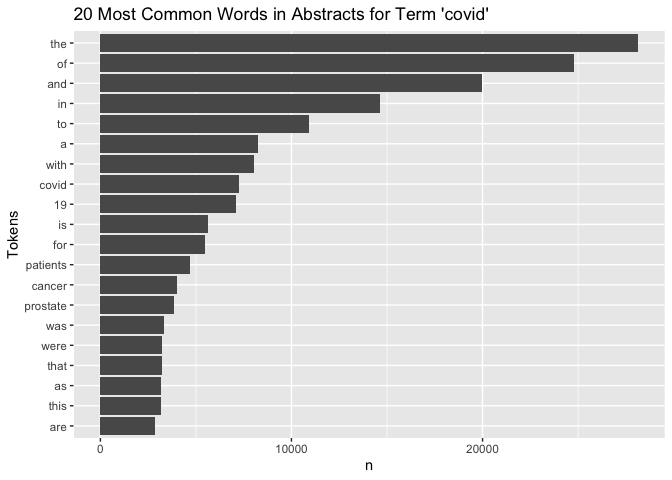
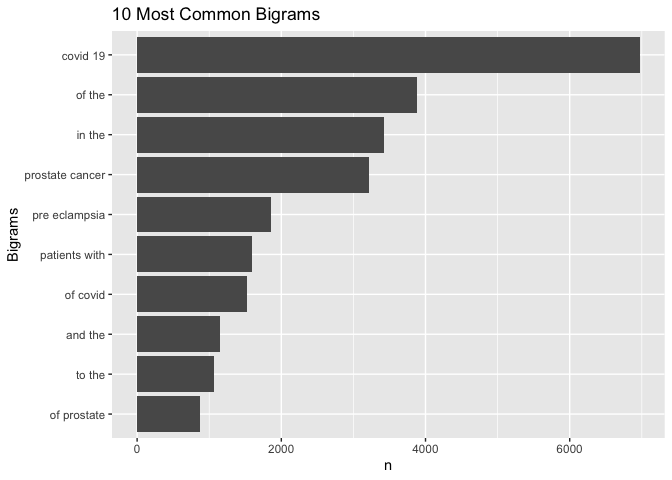

# APIs

Question: Using the NCBI API, look for papers that show up under the term "sars-cov-2 trial vaccine." Look for the data in the pubmed database, and then retrieve the details of the paper as shown in lab 7. How many papers were you able to find?


```r
# Downloading the website
website <- xml2::read_html("https://pubmed.ncbi.nlm.nih.gov/?term=sars-cov-2+trial+vaccine.")

# Finding the counts
counts <- xml2::xml_find_first(website, "/html/body/main/div[9]/div[2]/div[2]/div[1]/div[1]/span")

# Turning it into text
counts <- as.character(counts)

# Extracting the data using regex
stringr::str_extract(counts, "[0-9,]+")
```

```
## [1] "2,336"
```

2,336 papers were found under the term "sars-cov-2 trial vaccine" in the pubmed database.

Next step: Download each papers’ details.

First, get the Pubmed ID numbers


```r
query_ids <- GET(
  url    = "https://eutils.ncbi.nlm.nih.gov/entrez/eutils/esearch.fcgi",
  query  = list(db = "pubmed",
  term   = "sars-cov-2 trial vaccine",
#  rettype = "abstract",
  retmax = 250)
)

# Extracting the content of the response of GET
ids <- httr::content(query_ids)

# Turn the ids into a list
ids_list <- xml2::as_list(ids)

# Turn the result into a character vector
ids <- as.character(ids)

# Find all the ids 
ids <- stringr::str_extract_all(ids, "<Id>[[:digit:]]+</Id>")[[1]]

# Remove all the leading and trailing <Id> </Id>. Make use of "|"
ids <- stringr::str_remove_all(ids, "</?Id>")
ids <- stringr::str_remove_all(ids, "<Id>|</Id>")
```

Second, get the titles


```r
publications <- GET(
  url   = "https://eutils.ncbi.nlm.nih.gov/",
  path = "entrez/eutils/efetch.fcgi",
  query = list(
    db = "pubmed",
    id = I(paste(ids, collapse = ",")),
    retmax = 250,
    rettype = "abstract"
    )
)
# Turning the output into character vector
publications <- httr::content(publications)
publications_txt <- as.character(publications)

pub_char_list <- xml2::xml_children(publications)
pub_char_list <- sapply(pub_char_list, as.character)
```


```r
titles <- str_extract(pub_char_list, "<ArticleTitle>[[:print:][:space:]]+</ArticleTitle>")
titles <- str_remove_all(titles, "</?[[:alnum:]- =\"]+>")
```

Then, get the names of the journal where it was published


```r
journals <- str_extract(pub_char_list, "<Title>[[:print:][:space:]]+</Title>")
journals <- str_remove_all(journals, "</?[[:alnum:]- =\"]+>")
```

Next, get the Publication date


```r
date <- str_extract(pub_char_list, "<PubDate>[[:print:][:space:]]+</PubDate>")
date <- str_remove_all(date, "</?[[:alnum:]]+>")
date <- str_replace_all(date, "\\s+", " ")
```

Then, get the abstracts


```r
abstracts <- str_extract(pub_char_list, "<Abstract>[[:print:][:space:]]+</Abstract>")
abstracts <- str_remove_all(abstracts, "</?[[:alnum:]- =\"]+>")  #'</?[[:alnum:]- ="]+>'
abstracts <- str_replace_all(abstracts, "[[:space:]]+"," ")
```

Finally, put everything together into a single data.frame and use knitr::kable to print the results

Details of the first 5 papers are shown below.


```r
database <- data.frame(
  PubMedId = ids,
  Title    = titles,
  Journal = journals,
  Date = date,
  Abstract = abstracts
)
knitr::kable(database[1:8,], caption = "Details of the first 5 papers about sars-cov-2 trial vaccine")
```


Table: Details of the first 5 papers about sars-cov-2 trial vaccine

|PubMedId |Title                                                                                                                                                                              |Journal                                                                   |Date        |Abstract                                                                                                                                                                                                                                                                                                                                                                                                                                                                                                                                                                                                                                                                                                                                                                                                                                                                                                                                                                                                                                                                                                                                                                                                                                                                                                                                                                                                                                                                                                                                                                                                                                                                                                                                                                                                                                                                                                                                                                                                                                                                                                                                                                                                                                                                                                                          |
|:--------|:----------------------------------------------------------------------------------------------------------------------------------------------------------------------------------|:-------------------------------------------------------------------------|:-----------|:---------------------------------------------------------------------------------------------------------------------------------------------------------------------------------------------------------------------------------------------------------------------------------------------------------------------------------------------------------------------------------------------------------------------------------------------------------------------------------------------------------------------------------------------------------------------------------------------------------------------------------------------------------------------------------------------------------------------------------------------------------------------------------------------------------------------------------------------------------------------------------------------------------------------------------------------------------------------------------------------------------------------------------------------------------------------------------------------------------------------------------------------------------------------------------------------------------------------------------------------------------------------------------------------------------------------------------------------------------------------------------------------------------------------------------------------------------------------------------------------------------------------------------------------------------------------------------------------------------------------------------------------------------------------------------------------------------------------------------------------------------------------------------------------------------------------------------------------------------------------------------------------------------------------------------------------------------------------------------------------------------------------------------------------------------------------------------------------------------------------------------------------------------------------------------------------------------------------------------------------------------------------------------------------------------------------------------|
|34735795 |Immunogenicity of standard and extended dosing intervals of BNT162b2 mRNA vaccine.                                                                                                 |Cell                                                                      |2021 Oct 16 |Extension of the interval between vaccine doses for the BNT162b2 mRNA vaccine was introduced in the United Kingdom to accelerate population coverage with a single dose. At this time, trial data were lacking, and we addressed this in a study of United Kingdom healthcare workers. The first vaccine dose induced protection from infection from the circulating alpha (B.1.1.7) variant over several weeks. In a substudy of 589 individuals, we show that this single dose induces severe acute respiratory syndrome coronavirus 2 (SARS-CoV-2) neutralizing antibody (NAb) responses and a sustained B and T cell response to the spike protein. NAb levels were higher after the extended dosing interval (6-14 weeks) compared with the conventional 3- to 4-week regimen, accompanied by enrichment of CD4+ T cells expressing interleukin-2 (IL-2). Prior SARS-CoV-2 infection amplified and accelerated the response. These data on dynamic cellular and humoral responses indicate that extension of the dosing interval is an effective immunogenic protocol. Copyright © 2021 The Author(s). Published by Elsevier Inc. All rights reserved.                                                                                                                                                                                                                                                                                                                                                                                                                                                                                                                                                                                                                                                                                                                                                                                                                                                                                                                                                                                                                                                                                                                                                                       |
|34735426 |Effectiveness of 2-Dose Vaccination with mRNA COVID-19 Vaccines Against COVID-19-Associated Hospitalizations Among Immunocompromised Adults - Nine States, January-September 2021. |MMWR. Morbidity and mortality weekly report                               |2021 Nov 05 |Immunocompromised persons, defined as those with suppressed humoral or cellular immunity resulting from health conditions or medications, account for approximately 3% of the U.S. adult population (1). Immunocompromised adults are at increased risk for severe COVID-19 outcomes (2) and might not acquire the same level of protection from COVID-19 mRNA vaccines as do immunocompetent adults (3,4). To evaluate vaccine effectiveness (VE) among immunocompromised adults, data from the VISION Network* on hospitalizations among persons aged ≥18 years with COVID-19-like illness from 187 hospitals in nine states during January 17-September 5, 2021 were analyzed. Using selected discharge diagnoses,† VE against COVID-19-associated hospitalization conferred by completing a 2-dose series of an mRNA COVID-19 vaccine ≥14 days before the index hospitalization date§ (i.e., being fully vaccinated) was evaluated using a test-negative design comparing 20,101 immunocompromised adults (10,564 [53%] of whom were fully vaccinated) and 69,116 immunocompetent adults (29,456 [43%] of whom were fully vaccinated). VE of 2 doses of mRNA COVID-19 vaccine against COVID-19-associated hospitalization was lower among immunocompromised patients (77%; 95% confidence interval [CI] = 74%-80%) than among immunocompetent patients (90%; 95% CI = 89%-91%). This difference persisted irrespective of mRNA vaccine product, age group, and timing of hospitalization relative to SARS-CoV-2 (the virus that causes COVID-19) B.1.617.2 (Delta) variant predominance in the state of hospitalization. VE varied across immunocompromising condition subgroups, ranging from 59% (organ or stem cell transplant recipients) to 81% (persons with a rheumatologic or inflammatory disorder). Immunocompromised persons benefit from mRNA COVID-19 vaccination but are less protected from severe COVID-19 outcomes than are immunocompetent persons, and VE varies among immunocompromised subgroups. Immunocompromised persons receiving mRNA COVID-19 vaccines should receive 3 doses and a booster, consistent with CDC recommendations (5), practice nonpharmaceutical interventions, and, if infected, be monitored closely and considered early for proven therapies that can prevent severe outcomes. |
|34735018 |COVID-19 Therapeutics and Vaccines: A Race to save Lives.                                                                                                                          |Toxicological sciences : an official journal of the Society of Toxicology |2021 Nov 04 |COVID-19 (Coronavirus Disease 2019), the disease caused by SARS-CoV-2 (Severe Acute Respiratory Syndrome Coronavirus-2) is an ongoing global public health emergency. As understanding of the health effects of COVID-19 have improved, companies and agencies worldwide have worked together to identify therapeutic approaches, fast-track clinical trials and pathways for emergency use, and approve therapies for patients. This work has resulted in therapies that not only improve survival, reduce time of hospitalization and time to recovery, but also include preventative measures, such as vaccines. This manuscript discusses development programs for three products that are approved or authorized for emergency use at the time of writing: VEKLURY (remdesivir, direct acting antiviral from Gilead Sciences, Inc.), REGEN-COV (casirivimab and imdevimab antibody cocktail from Regeneron Pharmaceuticals Inc.) and Comirnaty (Pfizer-BioNTech COVID-19 Vaccine [Pfizer, Inc.-BioNTech]), and perspectives from the US Food and Drug Administration (FDA). Published by Oxford University Press 2021.                                                                                                                                                                                                                                                                                                                                                                                                                                                                                                                                                                                                                                                                                                                                                                                                                                                                                                                                                                                                                                                                                                                                                                                                       |
|34729549 |Adverse events of active and placebo groups in SARS-CoV-2 vaccine randomized trials: A systematic review.                                                                          |The Lancet regional health. Europe                                        |2021 Oct 28 |For safety assessment in clinical trials, adverse events (AEs) are reported for the drug under evaluation and compared with AEs in the placebo group. Little is known about the nature of the AEs associated with clinical trials of SARS-CoV-2 vaccines and the extent to which these can be traced to nocebo effects, where negative treatment-related expectations favor their occurrence. In our systematic review, we compared the rates of solicited AEs in the active and placebo groups of SARS-CoV-2 vaccines approved by the Western pharmaceutical regulatory agencies.We implemented a search strategy to identify trial-III studies of SARS-CoV-2 vaccines through the PubMed database. We adopted the PRISMA Statement to perform the study selection and the data collection and identified three trial: two mRNA-based (37590 participants) and one adenovirus type (6736 participants). Relative risks showed that the occurrence of AEs reported in the vaccine groups was higher compared with the placebo groups. The most frequently AEs in both groups were fatigue, headache, local pain, as injection site reactions, and myalgia. In particular, for first doses in placebo recipients, fatigue was reported in 29% and 27% in BNT162b2 and mRNA-1273 groups, respectively, and in 21% of Ad26.COV2.S participants. Headache was reported in 27% in both mRNA groups and in 24% of Ad26.COV2.S recipients. Myalgia was reported in 10% and 14% in mRNA groups (BNT162b2 and mRNA-1273, respectively) and in 13% of Ad26.COV2.S participants. Local pain was reported in 12% and 17% in mRNA groups (BNT162b2 and mRNA-1273, respectively), and in 17% of Ad26.COV2.S recipients. These AEs are more common in the younger population and in the first dose of placebo recipients of the mRNA vaccines. Our results are in agreement with the expectancy theory of nocebo effects and suggest that the AEs associated with COVID-19 vaccines may be related to the nocebo effect. Fondazione CRT - Cassa di Risparmio di Torino, IT (grant number 66346, "GAIA-MENTE" 2019). © 2021 The Authors.                                                                                                                                                                                                          |
|34726743 |Analysis of the Effectiveness of the Ad26.COV2.S Adenoviral Vector Vaccine for Preventing COVID-19.                                                                                |JAMA network open                                                         |2021 11 01  |Continuous assessment of the effectiveness and safety of the US Food and Drug Administration-authorized SARS-CoV-2 vaccines is critical to amplify transparency, build public trust, and ultimately improve overall health outcomes. To evaluate the effectiveness of the Johnson &amp; Johnson Ad26.COV2.S vaccine for preventing SARS-CoV-2 infection. <AbstractText Label="Design, Setting, and Participants">This comparative effectiveness research study used large-scale longitudinal curation of electronic health records from the multistate Mayo Clinic Health System (Minnesota, Arizona, Florida, Wisconsin, and Iowa) to identify vaccinated and unvaccinated adults between February 27 and July 22, 2021. The unvaccinated cohort was matched on a propensity score derived from age, sex, zip code, race, ethnicity, and previous number of SARS-CoV-2 polymerase chain reaction tests. The final study cohort consisted of 8889 patients in the vaccinated group and 88 898 unvaccinated matched patients. Single dose of the Ad26.COV2.S vaccine. The incidence rate ratio of SARS-CoV-2 infection in the vaccinated vs unvaccinated control cohorts, measured by SARS-CoV-2 polymerase chain reaction testing. The study was composed of 8889 vaccinated patients (4491 men [50.5%]; mean [SD] age, 52.4 [16.9] years) and 88 898 unvaccinated patients (44 748 men [50.3%]; mean [SD] age, 51.7 [16.7] years). The incidence rate ratio of SARS-CoV-2 infection in the vaccinated vs unvaccinated control cohorts was 0.26 (95% CI, 0.20-0.34) (60 of 8889 vaccinated patients vs 2236 of 88 898 unvaccinated individuals), which corresponds to an effectiveness of 73.6% (95% CI, 65.9%-79.9%) and a 3.73-fold reduction in SARS-CoV-2 infections. This study's findings are consistent with the clinical trial-reported efficacy of Ad26.COV2.S and the first retrospective analysis, suggesting that the vaccine is effective at reducing SARS-CoV-2 infection, even with the spread of variants such as Alpha or Delta that were not present in the original studies, and reaffirm the urgent need to continue mass vaccination efforts globally.                                                                                                                                                       |
|34715931 |Lessons from Israel's COVID-19 Green Pass program.                                                                                                                                 |Israel journal of health policy research                                  |2021 10 29  |As of the beginning of March 2021, Israeli law requires the presentation of a Green Pass as a precondition for entering certain businesses and public spheres. Entitlement for a Green Pass is granted to Israelis who have been vaccinated with two doses of COVID-19 vaccine, who have recovered from COVID-19, or who are participating in a clinical trial for vaccine development in Israel. The Green Pass is essential for retaining immune individuals' freedom of movement and for promoting the public interest in reopening the economic, educational, and cultural spheres of activity. Nonetheless, and as the Green Pass imposes restrictions on the movement of individuals who had not been vaccinated or who had not recovered, it is not consonant with solidarity and trust building. Implementing the Green Pass provision while advancing its effectiveness on the one hand, and safeguarding equality, proportionality, and fairness on the other hand may imbue this measure with ethical legitimacy despite involving a potential breach of trust and solidarity. © 2021. The Author(s).                                                                                                                                                                                                                                                                                                                                                                                                                                                                                                                                                                                                                                                                                                                                                                                                                                                                                                                                                                                                                                                                                                                                                                                                                  |
|34713912 |Vaccine development and technology for SARS-CoV-2: current insights.                                                                                                               |Journal of medical virology                                               |2021 Oct 29 |SARS-CoV-2 is associated to a severe respiratory disease in China, that rapidly spread across continents. Since the beginning of the pandemic, available data suggested the asymptomatic transmission and patients were treated with specific drugs with efficacy and safety data not always satisfactory. The aim of this review is to describe the vaccines developed by three companies, Pfizer-BioNTech, Moderna and University of Oxford/AstraZeneca, in terms of both technological and pharmaceutical formulation, safety, efficacy and immunogenicity. A critical analysis of phase 1, 2 and 3 clinical trial results available was conducted, comparing the three vaccine candidates, underlining their similarities and differences. All candidates showed consistent efficacy and tolerability; although some differences can be noted, such as their technological formulation, temperature storage, which will be related to logistics and costs. Further studies will be necessary to evaluate long-term effects and to assess the vaccine safety and efficacy in the general population. This article is protected by copyright. All rights reserved. This article is protected by copyright. All rights reserved.                                                                                                                                                                                                                                                                                                                                                                                                                                                                                                                                                                                                                                                                                                                                                                                                                                                                                                                                                                                                                                                                                                 |
|34711598 |BCG vaccination to reduce the impact of COVID-19 in healthcare workers: Protocol for a randomised controlled trial (BRACE trial).                                                  |BMJ open                                                                  |2021 10 28  |BCG vaccination modulates immune responses to unrelated pathogens. This off-target effect could reduce the impact of emerging pathogens. As a readily available, inexpensive intervention that has a well-established safety profile, BCG is a good candidate for protecting healthcare workers (HCWs) and other vulnerable groups against COVID-19. This international multicentre phase III randomised controlled trial aims to determine if BCG vaccination reduces the incidence of symptomatic and severe COVID-19 at 6 months (co-primary outcomes) compared with no BCG vaccination. We plan to randomise 10 078 HCWs from Australia, The Netherlands, Spain, the UK and Brazil in a 1:1 ratio to BCG vaccination or no BCG (control group). The participants will be followed for 1 year with questionnaires and collection of blood samples. For any episode of illness, clinical details will be collected daily, and the participant will be tested for SARS-CoV-2 infection. The secondary objectives are to determine if BCG vaccination reduces the rate, incidence, and severity of any febrile or respiratory illness (including SARS-CoV-2), as well as work absenteeism. The safety of BCG vaccination in HCWs will also be evaluated. Immunological analyses will assess changes in the immune system following vaccination, and identify factors associated with susceptibility to or protection against SARS-CoV-2 and other infections. Ethical and governance approval will be obtained from participating sites. Results will be published in peer-reviewed open-access journals. The final cleaned and locked database will be deposited in a data sharing repository archiving system. ClinicalTrials.gov NCT04327206. © Author(s) (or their employer(s)) 2021. Re-use permitted under CC BY. Published by BMJ.                                                                                                                                                                                                                                                                                                                                                                                                                                                                                         |

# Text Mining

Instruction: A new dataset has been added to the data science data repository https://github.com/USCbiostats/data-science-data/tree/master/03_pubmed. The dataset contains 3241 abstracts from articles across 5 search terms. Your job is to analyse these abstracts to find interesting insights.

## Read in the data


```r
fn <- "hw3.csv"
if (!file.exists(fn))
  download.file("https://raw.githubusercontent.com/USCbiostats/data-science-data/master/03_pubmed/pubmed.csv", destfile = fn)

hw3<-read.csv(fn)
hw3<-as_tibble(hw3)
```

## Question 1

Tokenize the abstracts and count the number of each token. Do you see anything interesting? Does removing stop words change what tokens appear as the most frequent? What are the 5 most common tokens for each search term after removing stopwords?

First, tokenize the abstracts and count the number of the top 20 most common tokens


```r
# table
hw3 %>%
  unnest_tokens(output = token, input = abstract) %>%
  count(token, sort = TRUE) %>%
  top_n(20,n) %>%
  knitr::kable()
```


|token    |     n|
|:--------|-----:|
|the      | 28126|
|of       | 24760|
|and      | 19993|
|in       | 14653|
|to       | 10920|
|a        |  8245|
|with     |  8038|
|covid    |  7275|
|19       |  7080|
|is       |  5649|
|for      |  5492|
|patients |  4674|
|cancer   |  3999|
|prostate |  3832|
|was      |  3315|
|that     |  3226|
|were     |  3226|
|as       |  3159|
|this     |  3158|
|are      |  2833|

```r
# plot
hw3 %>%
  unnest_tokens(output = token, input = abstract) %>%
  count(token, sort = TRUE) %>%
  top_n(20,n) %>%
  ggplot(aes(n, fct_reorder(token, n)))+
  geom_col()+
  ylab("Tokens") +
  labs(title = "20 Most Common Words in Abstracts for Term 'covid'")
```

<!-- -->

We found that many of the most frequent tokens were stop words, which were showing little information to us. Still, there were some tokens, such as "covid", "patients" and two other words which were related to the topic "covid" had high frequencies.

Then, remove stop words


```r
# table
hw3 %>%
  unnest_tokens(output = token, input = abstract) %>%
  count(token, sort = TRUE) %>%
  anti_join(stop_words, by = c("token" = "word")) %>%
  top_n(20,n) %>%
  knitr::kable()
```


|token        |    n|
|:------------|----:|
|covid        | 7275|
|19           | 7080|
|patients     | 4674|
|cancer       | 3999|
|prostate     | 3832|
|disease      | 2574|
|pre          | 2165|
|eclampsia    | 2005|
|preeclampsia | 1863|
|treatment    | 1841|
|clinical     | 1682|
|risk         | 1588|
|women        | 1327|
|study        | 1299|
|results      | 1281|
|severe       | 1063|
|diagnosis    | 1015|
|pregnancy    | 1011|
|data         |  945|
|health       |  922|

```r
# plot
hw3 %>%
  unnest_tokens(output = token, input = abstract) %>%
  count(token, sort = TRUE) %>%
  anti_join(stop_words, by = c("token" = "word")) %>%
  top_n(20,n) %>%
  ggplot(aes(n, fct_reorder(token, n)))+
  geom_col()+
  ylab("Tokens") +
  labs(title = "20 Most Common Words in Abstracts for Term 'covid'")
```

<!-- -->

After removing stop words, the table and the plot were showing more information which were related to "covid" to us. We observed that tokens "covid", "patients" and "cancer" have higher frequencies.

Next, show the 5 most common tokens for each search term after removing stop words.


```r
hw3 %>%
  unnest_tokens(output = token, input = abstract) %>%
  group_by(term) %>%
  count(token, sort = TRUE) %>%
  anti_join(stop_words, by = c("token" = "word")) %>%
  top_n(5,n) %>%
  knitr::kable()
```


|term            |token        |    n|
|:---------------|:------------|----:|
|covid           |covid        | 7275|
|covid           |19           | 7035|
|prostate cancer |cancer       | 3840|
|prostate cancer |prostate     | 3832|
|covid           |patients     | 2293|
|preeclampsia    |pre          | 2038|
|preeclampsia    |eclampsia    | 2005|
|preeclampsia    |preeclampsia | 1863|
|preeclampsia    |women        | 1196|
|preeclampsia    |pregnancy    |  969|
|covid           |disease      |  943|
|prostate cancer |patients     |  934|
|prostate cancer |treatment    |  926|
|cystic fibrosis |fibrosis     |  867|
|cystic fibrosis |cystic       |  862|
|covid           |pandemic     |  800|
|prostate cancer |disease      |  652|
|cystic fibrosis |cf           |  625|
|cystic fibrosis |patients     |  586|
|meningitis      |patients     |  446|
|meningitis      |meningitis   |  429|
|cystic fibrosis |disease      |  400|
|meningitis      |meningeal    |  219|
|meningitis      |csf          |  206|
|meningitis      |clinical     |  187|

For term “covid”, the 5 most common tokens were “covid”, “19”, “patients”, “disease” and “pandemic”.

For term “meningitis”, the 5 most common tokens were “patients”, “meningitis”, “meningeal”, “csf” and “clinical”.

For term “prostate cancer”, the 5 most common tokens were “cancer”, “prostate”, “patients”, “treatment” and “disease”.

For term “cystic fibrosis”, the 5 most common tokens were “fibrosis”, “cystic”, “cf”, “patients” and “disease”.

For term “preeclampsia”, the 5 most common tokens were “pre, ”“eclampsia”, “preeclampsia”, “women” and “pregnancy”.

## Question 2

Tokenize the abstracts into bigrams. Find the 10 most common bigram and visualize them with ggplot2.


```r
hw3 %>%
  unnest_ngrams(output = bigram, input = abstract, n = 2) %>%
  count(bigram, sort = TRUE) %>%
  top_n(10)%>%
  ggplot(aes(n, fct_reorder(bigram,n))) + 
  geom_col() +
  ylab("Bigrams") +
  labs(title = "10 Most Common Bigrams")
```

```
## Selecting by n
```

<!-- -->

Since there were many stop words, such as "of the", "in the", "to the" and so on, which were making no sense here, we remove stop words


```r
bigram <- hw3 %>%
  unnest_ngrams(output = bigram, input = abstract, n = 2) %>%
  separate(bigram, into = c("word1", "word2"), sep = " ") %>%
  select(word1, word2) %>%
  anti_join(stop_words, by = c("word1" = "word")) %>%
  anti_join(stop_words, by = c("word2" = "word")) %>%
  count(word1, word2, sort = TRUE) %>%
  top_n(10)
```

```
## Selecting by n
```

```r
bigram$bigram <- paste(bigram$word1, bigram$word2)
bigram %>%
  ggplot(aes(n, fct_reorder(bigram,n))) + 
  geom_col() +
  ylab("Bigrams") +
  labs(title = "10 Most Common Bigrams")
```

<!-- -->

After removing stop words, the tokens were making more sense. The most common tokens were "covid 19", "prostate cancer", "pre eclampsia", "cystic fibrosis" and so on.

## Question 3

Calculate the TF-IDF value for each word-search term combination. (here you want the search term to be the “document”) What are the 5 tokens from each search term with the highest TF-IDF value? How are the results different from the answers you got in question 1?


```r
hw3 %>%
  unnest_tokens(word, abstract) %>%
  count(word, term) %>%
  bind_tf_idf(word, term, n) %>%
  group_by(term) %>%
  arrange(desc(tf_idf), .by_group=TRUE) %>%
  top_n(5,tf_idf) %>%
  knitr::kable()
```


|word            |term            |    n|        tf|       idf|    tf_idf|
|:---------------|:---------------|----:|---------:|---------:|---------:|
|covid           |covid           | 7275| 0.0371050| 1.6094379| 0.0597183|
|pandemic        |covid           |  800| 0.0040803| 1.6094379| 0.0065670|
|coronavirus     |covid           |  647| 0.0032999| 1.6094379| 0.0053110|
|sars            |covid           |  372| 0.0018973| 1.6094379| 0.0030536|
|cov             |covid           |  334| 0.0017035| 1.6094379| 0.0027417|
|cf              |cystic fibrosis |  625| 0.0127188| 0.9162907| 0.0116541|
|fibrosis        |cystic fibrosis |  867| 0.0176435| 0.5108256| 0.0090127|
|cystic          |cystic fibrosis |  862| 0.0175417| 0.5108256| 0.0089608|
|cftr            |cystic fibrosis |   86| 0.0017501| 1.6094379| 0.0028167|
|sweat           |cystic fibrosis |   83| 0.0016891| 1.6094379| 0.0027184|
|meningitis      |meningitis      |  429| 0.0091942| 1.6094379| 0.0147974|
|meningeal       |meningitis      |  219| 0.0046935| 1.6094379| 0.0075539|
|pachymeningitis |meningitis      |  149| 0.0031933| 1.6094379| 0.0051394|
|csf             |meningitis      |  206| 0.0044149| 0.9162907| 0.0040453|
|meninges        |meningitis      |  106| 0.0022718| 1.6094379| 0.0036562|
|eclampsia       |preeclampsia    | 2005| 0.0142784| 1.6094379| 0.0229802|
|preeclampsia    |preeclampsia    | 1863| 0.0132672| 1.6094379| 0.0213527|
|pregnancy       |preeclampsia    |  969| 0.0069006| 0.5108256| 0.0035250|
|maternal        |preeclampsia    |  797| 0.0056757| 0.5108256| 0.0028993|
|gestational     |preeclampsia    |  191| 0.0013602| 1.6094379| 0.0021891|
|prostate        |prostate cancer | 3832| 0.0311890| 1.6094379| 0.0501967|
|androgen        |prostate cancer |  305| 0.0024824| 1.6094379| 0.0039953|
|psa             |prostate cancer |  282| 0.0022952| 1.6094379| 0.0036940|
|prostatectomy   |prostate cancer |  215| 0.0017499| 1.6094379| 0.0028164|
|castration      |prostate cancer |  148| 0.0012046| 1.6094379| 0.0019387|

For term “covid”, the 5 most common tokens were “covid”, “pandemic”, “coronavirus”, “sars” and "cov".

For term “cystic fibrosis”, the 5 most common tokens were “cf”, “fibrosis”, “cystic”, "cftr" and “sweat”.

For term “meningitis”, the 5 most common tokens were “meningitis”, “meningeal”, “pachymeningitis” and “csf”.

For term “preeclampsia”, the 5 most common tokens were “eclampsia”, “preeclampsia”, “pregnancy”, "maternal" and “gestational”.

For term “prostate cancer”, the 5 most common tokens were “prostate”, "androgen", “psa”, “prostatectomy” and “castration”.

Compared to the 5 most common tokens in question 1, tokens here were more likely to be somewhat scientific terms which show more information that were specifically related to our word-search term, while tokens in question 1 were more general words which showed us less professional information about the word-search term.
